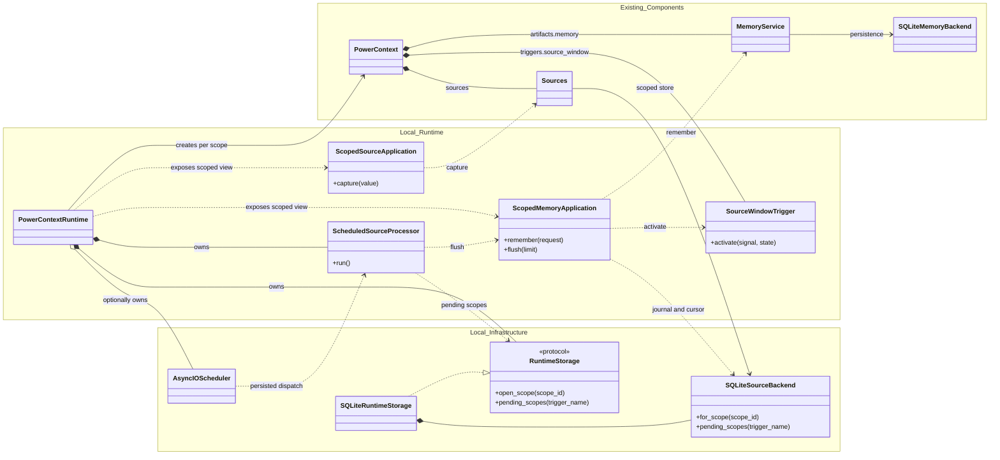
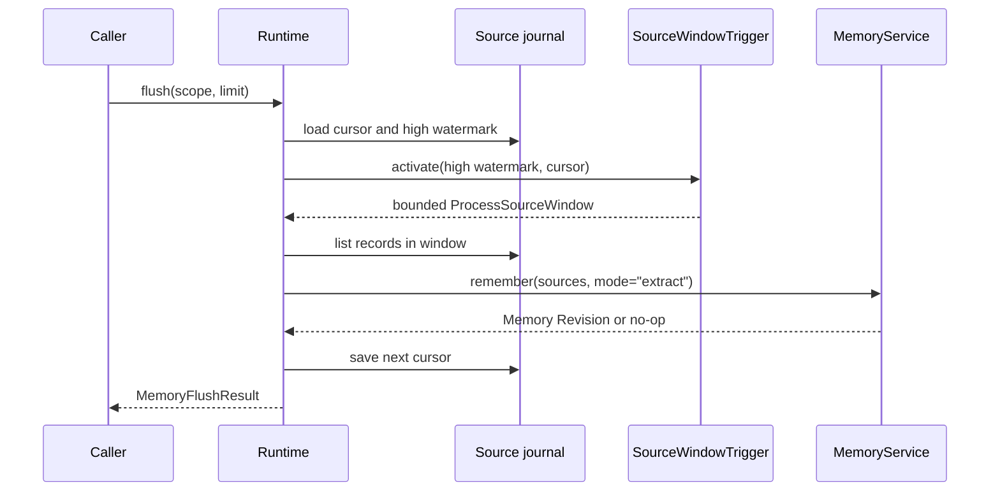

- Proposal Name: `local_source_memory_runtime`
- Start Date: 2026-07-24
- RFC PR: [oceanbase/powercontext#19](https://github.com/oceanbase/powercontext/pull/19)

> **Note:** PowerContext now uses bundled sqlite-vec for SQLite vector search. Statements about Vec1 in this RFC no
> longer apply and remain only as a record of the original design.

> **Execution update:** [RFC 1430](1430_distributed_server_workers.md) replaces the APScheduler sidecar and
> single-process execution assumptions with one database-backed Work Ledger for local and distributed modes. This RFC
> remains authoritative for Source window, cursor, Memory, and domain commit semantics.

# Summary

This RFC proposes backend-neutral Runtime storage contracts and a built-in SQLite profile. The Runtime uses the
`PowerContext` composition root to assemble scoped Sources, the Memory Artifact Family, and `SourceWindowTrigger`.
The SQLite profile stores Source journals, Trigger cursors, Memory bindings, and Memory Revisions in one Runtime
database. APScheduler uses a separate SQLite sidecar.

The Runtime provides two independent paths. Explicit Memory writes call
`MemoryService.remember(mode="append")` directly. Source capture stores raw working material only. A manual `flush()`
or scheduled activation later calls `MemoryService.remember(mode="extract")`. Writing a Source does not implicitly
create Memory.

This RFC adopts single-process, at-least-once local execution semantics. It does not introduce a Workflow store,
claims, leases, distributed scheduling, or an exactly-once guarantee. It also does not establish Agent turns, task
outcomes, or other product events as default Source types.

# Motivation

The [Core Protocol](../development/core-protocol.md) already defines Source, Artifact, Trigger, and the `PowerContext`
composition model. The [Memory Layer](../development/memory-layer.md) already provides Memory persistence, search,
Revisions, and candidate extraction. What is missing is a concrete Runtime that answers these questions:

- How does a business scope obtain a composed Source, Memory, and Trigger instance?
- When does a captured Source enter the Memory candidate pipeline?
- Where is Trigger State stored, and where does recovery start after a failure?
- How does a timer activate the Runtime without owning domain state?
- How does SQLite preserve recoverable, exact references between Sources and Memory evidence?

If each Server, CLI, or Agent integration answers these questions independently, they will gradually acquire
different scope rules, cursor semantics, and recovery behavior. Putting these rules in the Core Protocol would cause
Core to depend on SQLite, APScheduler, and a specific Memory profile.

This RFC places those choices in an optional integration Runtime. Higher layers can call it locally and expose it
through HTTP or MCP in later proposals. Neither the Core Protocol nor `MemoryService` needs to know about transport
or process topology.

# Guide-level explanation

## Runtime composition

Callers create the SQLite profile with `PowerContextRuntime.open()`:

```python
runtime = await PowerContextRuntime.open(
    "powercontext.db",
    candidate_pipeline=candidate_pipeline,
    source_window_limit=100,
    schedule_seconds=30,
)
```

Other storage profiles implement `RuntimeStorage` and use `PowerContextRuntime.assemble()`. Runtime orchestration
depends on `RuntimeStorage` and `RuntimeScopeStorage`, not on a concrete Source or Memory backend.

The owning application may inject `candidate_pipeline`. A Runtime without one still supports explicit Memory writes,
reads, and full-text search. Processing a non-empty Source window then reports that extraction is unavailable and does
not advance the cursor. Scheduled Source processing requires a pipeline at startup. The Runtime does not provide
test-only task outcome or working note defaults, and it does not select a generative model for the caller. Without
stable product semantics, the Runtime should not guess whether a Source should become a fact, decision, or working
note.

Embedding is independently optional. The owning application supplies an `EmbeddingModel`; the SQLite profile also
receives the exact matching `EmbeddingProfile` and Vec1 extension path. The Runtime forwards those components to
`MemoryService` and the backend but does not select a provider, read credentials, or change profiles at runtime.

The Runtime uses `scope_id` to select application services:

```python
project_sources = runtime.sources.for_scope("project:powercontext")
project_memory = runtime.memory.for_scope("project:powercontext")
```

A scope is an opaque, integration-owned string. The Runtime does not promote a repository, session, tenant, or Agent
turn to a Core concept. It lazily creates the following composition for each scope:



The diagram keeps only the orchestration boundary. `Existing_Components` contains capabilities reused by this RFC,
`Local_Runtime` contains the new application and Trigger logic, and `Local_Infrastructure` provides persistence and
timed wakeups. For readability, the diagram folds typed component groups into the two labeled `PowerContext`
relationships and omits selector facades, catalogs, adapters, codecs, DTOs, records, and locks.

The new types form four call paths:

| Entry point | Call path | Result |
| --- | --- | --- |
| Source capture | `SourceApplication` → `ScopedSourceApplication` → `Sources` → `SourceCatalog` / `SQLiteScopedSourceBackend` | The adapter resolves input; the backend persists the canonical Source and journal sequence |
| Explicit Memory command | `MemoryApplication` → `ScopedMemoryApplication` → `MemoryService` → `SQLiteMemoryBackend` | Commits caller-confirmed Memory entries in `append` mode |
| Manual Source flush | `ScopedMemoryApplication` → `SQLiteScopedSourceBackend` → `SourceWindowTrigger` → `MemoryService` | Reads a bounded window, commits Memory in `extract` mode, then saves the cursor |
| Scheduled Source flush | `AsyncIOScheduler` → `dispatch_source_windows()` → `ScheduledSourceProcessor` → `MemoryApplication` → `ScopedMemoryApplication.flush()` | Restores the persisted job, finds pending scopes, and reuses the same flush path |

`PowerContextRuntime` is not a new domain composition root. It owns process-level resources, and it creates and
caches a `_ScopedRuntime` for each `scope_id`. The `PowerContext` in `_ScopedRuntime.context` is the actual composition
root for Sources, the Memory Artifact Family, and the Trigger.

Each scope maps to a stable, globally unique Memory Artifact identity through a Runtime-owned `MemoryBindingStore`.
The SQLite profile persists this one-to-one binding. Different scopes share one Runtime database, but their Source
journals, cursors, Memory identities, and mutation locks remain isolated.

## Explicit Memory writes

When the caller already knows which semantics to store, it should write directly to Memory:

```python
result = await project_memory.remember(
    RememberMemoryRequest(
        entries=(
            MemoryEntryInput(
                kind="decision",
                text="Use SQLite for the local Runtime profile.",
            ),
        ),
        expected_revision=None,
    )
)
```

This path calls `MemoryService.remember(mode="append")`. It neither creates a Source nor calls the candidate pipeline.
The caller may provide an expected revision to detect stale writes. If the content causes no material change,
`MemoryService` may return the same Revision. The Runtime does not fabricate a new entry.

Explicit writes suit user-confirmed decisions, constraints, and handoffs. They should not be wrapped in a fabricated
Source merely to make all writes follow one path.

## Capturing a Source

A higher-level integration can first store actual working material:

```python
receipt = await project_sources.capture(
    ContentCapture(
        source_id="task-2026-07-24",
        content="The Runtime uses a persisted APScheduler interval job.",
        metadata={"origin": "integration"},
    )
)
```

`ContentCapture` is integration input. `ContentSourceAdapter` resolves it to `ContentSource`, a concrete
implementation of Core `Source`. `ContentSource.name` uses the stable `source_id` supplied by the caller. The Source
type uses the public name `content`.

`capture()` performs only these operations:

1. Resolve `ContentCapture`.
2. Persist `ContentSource`.
3. Allocate a monotonically increasing journal sequence for the scope.
4. Return the canonical Source and sequence.

`ContentCapture` validates metadata as JSON and snapshots it when the value is constructed. The returned
`ContentSource` does not share caller-owned mutable containers. Content, description, and metadata form the canonical
Source payload.

Capturing the same canonical payload again with the same scope, Source type, and Source identity is idempotent. If the
same identity refers to a different payload, the Runtime returns `SourceConflictError`. It must not silently bypass
the conflict by generating another identity.

Source persistence does not require an adapter for `get()` or `list()`. The adapter handles only `resolve()` and
`read()`; it does not own a persisted Source's identity.

## Processing a Source window manually

The caller can explicitly process the next segment of the Source journal:

```python
flush = await project_memory.flush(limit=100)
```

The processing path is:



`SourceWindowTrigger` is a pure policy. It selects the next non-empty window from the current cursor, journal high
watermark, and window limit. The Trigger does not access the database, call a model, or execute an Action.

Within one scope lock, the Runtime reads state, runs extraction, and saves the cursor. The candidate pipeline receives
complete canonical Sources and can generate candidates based on the current Memory head. The cursor advances only
after the entire window succeeds. An extraction that makes no Memory changes still counts as success because the
Runtime has inspected that Source window.

If the cursor has reached the high watermark, `flush()` returns an idle result and does not create an empty Memory
Revision.

## Scheduled processing

When `schedule_seconds` is set, APScheduler periodically activates the same flush path. APScheduler neither chooses
the Source window nor stores the Trigger cursor.

`SQLAlchemyJobStore` stores the interval job in a dedicated SQLite sidecar. The persisted job uses a stable,
module-level async callable. Its argument contains only the normalized Runtime database key. It does not contain a
`PowerContextRuntime`, candidate pipeline, or bound method.

At process startup, the Runtime first registers the processor for the database key. It then starts the scheduler in
a paused state, restores or reconciles the fixed job, and resumes scheduling. During shutdown, the Runtime stops the
scheduler, waits for the running processor to exit, and then closes the Memory and Source backends.

This design lets the scheduler job survive process restarts without writing non-portable application objects to the
job store.

# Reference-level explanation

## Public boundary

This RFC adds the following public runtime surface:

| Type | Purpose |
| --- | --- |
| `PowerContextRuntime` | Owns local resources and scoped application services |
| `RuntimeStorage` | Creates backend-neutral scope storage and lists pending scopes |
| `RuntimeScopeStorage` | Supplies one scope's Source backend, Memory backend, evidence codec, and lifecycle |
| `MemoryBindingStore` | Resolves the stable Memory Artifact identity for a scope |
| `SourceApplication` | Selects a scoped Source service |
| `ScopedSourceApplication` | Captures `ContentSource` instances |
| `MemoryApplication` | Selects a scoped Memory service |
| `ScopedMemoryApplication` | Runs Memory commands, queries, and Source flushes |
| `ContentCapture` | Captured text input supplied by an integration |
| `ContentSource` | Captured text with Core Source semantics |
| `SourceWindowTrigger` | Computes the next bounded Source window |

Concrete persistence schemas, cursor rows, the scheduler registry, and the Pydantic evidence payload are implementation
details of the current SQLite profile. The storage protocols define the adapter boundary without promoting SQLite
schemas into general Source, Trigger, or transport contracts.

`BuiltinArtifacts` is the typed Artifact group in `PowerContext`; the Source-window application is bound directly as
the Trigger component. Neither introduces a global Artifact or Trigger catalog.

## Initialization

`PowerContextRuntime.open()` returns only after the SQLite Source schema, Memory binding store, Memory schema, and FTS5
projection have initialized successfully. When an embedding profile is configured, startup also loads and probes the
matching Vec1 extension. Invalid window, scheduler, or vector configuration is rejected before Source storage opens.
Higher-level process readiness can therefore rely on a successful Runtime open instead of discovering a broken Memory
backend on the first scoped request.

## Scope and Memory identity

A scope must be a non-empty string no longer than 256 characters. The Runtime treats it as an application partition
key and does not parse business structure from it.

`MemoryBindingStore` persists a one-to-one mapping from `scope_id` to a globally unique Memory Artifact ID. Resolving
an existing scope returns the same ID after restart; two independent stores do not derive the same identity merely
because callers chose the same scope string. Binding existence reserves an identity and does not imply that Revision 1
already exists.

The binding only locates the scope's Memory head. Memory Revisions, entry identity, and evidence lineage retain the
existing Memory Layer constraints. This profile currently gives each scope one Memory Artifact. Supporting multiple
instances requires an explicit extension of the application mapping.

## Source journal

Runtime storage owns three kinds of scoped state. The SQLite profile persists them as separate tables:

| State | Partition | Constraint |
| --- | --- | --- |
| Source journal | `scope_id` | Sequences increase monotonically |
| Trigger cursor | `scope_id + trigger_name` | The cursor can only advance |
| Memory binding | `scope_id` | The Artifact ID is stable and unique |

Within a scope, Source type and Source name determine Source identity. A journal sequence is a processing position,
not a Source identity. An idempotent replay of the same Source returns its existing position and does not append
another journal record.

`pending_scopes()` compares the maximum journal sequence for each scope with its saved cursor. The scheduled processor
handles only scopes with unconsumed Sources, and it continues with other scopes after one scope fails.

## Pydantic persistence boundary

The `ContentSource` payload is encoded and decoded with `TypeAdapter(ContentSource).dump_json()` and
`validate_json()`. The Runtime does not maintain a handwritten JSON field parser.

A private, strict Pydantic schema represents Source evidence references. Its fields include scope, Source type, and
Source identity. After decoding, the backend loads the canonical Source. A caller cannot inject an unpersisted Source
through the evidence payload.

Artifact evidence continues to use Core `ArtifactRef` at the public boundary. The private schema only validates
persisted data strictly and returns a Core object on success. It does not add `TaskOutcomeReport` or another parallel
Artifact reference type.

APScheduler serializes its own job state. That state belongs to a trusted local database and must not be loaded from
an untrusted database file.

## Trigger transition

`SourceWindowTrigger.activate()` accepts:

```text
Signal: SourceHighWatermark(sequence, limit)
State:  SourceCursor(sequence)
```

When the high watermark is not greater than the cursor, the transition has no Action and leaves State unchanged.
Otherwise:

```text
through = min(high_watermark, cursor + limit)
next_state = SourceCursor(through)
action = ProcessSourceWindow(after=cursor, through=through)
```

The Runtime saves the Trigger's next State only after the Action succeeds. A pure Trigger does not claim to have
executed the Action.

## Concurrency and lifecycle

The Runtime uses four layers of local synchronization:

- A lifecycle gate rejects new application operations after shutdown begins and lets already admitted operations
  finish before owned backends close.
- A scope lock serializes remember, revise, retire, and flush operations within one scope.
- A processor lock prevents the scheduler processor from racing with Runtime shutdown.
- A backend lock protects synchronous access to one APSW connection.

Shutdown first pauses scheduling, closes the lifecycle gate, waits for admitted application operations and the active
processor, and only then shuts down APScheduler and the backends. APScheduler must not cancel a window that the
Runtime has already admitted. `close()` is idempotent, and a caller may invoke it again to finish cleanup if an earlier
close await was cancelled.

The SQLite Runtime connections enable WAL and a busy timeout. `SQLAlchemyJobStore` uses a separate sidecar so its
pysqlite connection does not contend with APSW over Runtime state.

One live `PowerContextRuntime` owns a runtime database file. The implementation proactively rejects two scheduled
Runtime instances for the same database in one process, but it does not maintain a general process-wide owner registry,
cross-process leader election, or a file lock. The host must not open concurrent Runtime owners for one database.
Internal backend connections belonging to the one owner may still overlap.

Runtime locks coordinate one object graph, but durable monotonic state cannot depend on those locks. The Source
backend enforces cursor advancement atomically in SQLite, including when more than one connection accesses the file.

An `:memory:` database can be used when scheduling is disabled. A persistent scheduler requires a file-backed Runtime
database so its sidecar path and processor key remain stable after restart.

## Failure semantics

A Source window commits in this order:

```text
read cursor
read Sources
commit Memory
save cursor
```

If candidate extraction, the Memory commit, or Source decoding fails, the cursor does not advance. The next
activation retries the same window.

If the Memory commit succeeds but saving the cursor fails, the next activation also replays the window. Existing
`MemoryService` deduplication may recognize the replay as a no-op, but this RFC does not promote that behavior to an
exactly-once guarantee. The candidate pipeline must accept the same canonical Source more than once.

The cursor still advances when a complete window succeeds without producing candidates. Otherwise, a Source with no
extractable content would permanently block later journal records.

Exact entry operations distinguish identity from revision. A citation for another scope's Memory raises
`ArtifactNotFoundError`; an older Revision of the correct Memory raises `RevisionConflictError`; and an entry anchor
missing from the cited manifest raises `MemoryEntryNotFoundError`. A changes request newer than the current head raises
`InvalidRuntimeRequestError`.

## Packaging

The accepted implementation is distributed as one Builtin role:

| Extra | Dependencies |
| --- | --- |
| `builtin` | Runtime, SQLite, OceanBase, APScheduler, SQLAlchemy, and Pydantic AI integration |

Server, Client, and CLI dependencies remain outside `builtin`. The Server extra includes Builtin because every standard
Server process owns one configured Builtin runtime. The CLI extra includes Client and exposes Server-backed content
commands at the root; an installed Server role contributes process-control commands through entry-point discovery.

# Drawbacks

The SQLite profile places the Source journal, binding, cursor, and Memory backend in one Runtime database. Their
writes still share SQLite locks. The scheduler sidecar removes mixed-driver contention but does not turn the Runtime
database into a multi-worker store.

One scope maps to one Memory Artifact. That fits the current project Memory use case, but it cannot represent several
independent Memory instances in one scope. Supporting that case requires a new application mapping.

The Source window and Memory commit do not share a database transaction. Although both backends use the same file,
`MemoryService` and the Source journal do not currently share a transaction boundary. The Runtime therefore provides
at-least-once processing rather than an atomic Memory-and-cursor commit.

Persisted APScheduler job state creates a local on-disk ABI. The stable dispatcher path cannot move freely, and an
APScheduler major-version upgrade requires a separate job migration assessment.

# Rationale and alternatives

## Generate Memory automatically during Source capture

This approach gives callers a smaller API, but it couples Source writes to model calls. A caller could no longer
store evidence alone or choose between manual, scheduled, and other Triggers. Retry behavior and cost control would
also become hidden `SourceCatalog` behavior.

This RFC keeps `capture()` and `flush()` separate.

## Store the cursor in APScheduler

APScheduler can store a time trigger and its next run time, but it is not a suitable model for a scoped Source high
watermark. Placing the cursor in a job argument would couple Source processing state to scheduler serialization and
make dynamically discovered scopes difficult to handle.

This RFC makes the scheduler responsible for wakeups and the Runtime responsible for the cursor.

## Persist a bound method directly

Persisting `runtime.processor.run` would either serialize the Runtime object graph or depend on a process-local
instance that cannot be recovered. The candidate pipeline, database connection, and locks do not belong in job
state.

This RFC uses a stable module-level dispatcher and a process-local registry.

## Implement a Workflow store first

A Workflow store with compare-and-set, claims, leases, and idempotency keys could support multiple workers, but it
would add a new durable state machine and recovery protocol. The current local profile permits only one scheduled
process, and there is no evidence that it needs this complexity.

This RFC starts with APScheduler and a monotonic cursor. Cross-process execution should introduce a separate workflow
ownership design.

## Add a default Source type for Agent turns or task outcomes

An Agent turn is an observable boundary, but it does not imply task completion or guarantee a reusable result. Task
outcome fields and lifecycles belong to a specific integration. Adding those types to the default Runtime would tie
the Memory candidate pipeline to one Agent product.

This RFC provides only the neutral `ContentSource`. An integration can define other Source types as long as they
follow the public Source semantics.

# Prior art

This design follows the separation between the Core Protocol and the integration runtime established in
[RFC 0002](0002_core_sdk_product_model.md). It also reuses the `MemoryService`, Revision, candidate pipeline, and
evidence contracts from [RFC 0014](0014_memory_layer_design.md).

The Core Protocol documentation already uses SQLite and APScheduler to explain a local runtime without making them
Core dependencies. This RFC turns that example into a concrete, optional profile.

# Compatibility

The public Runtime types are a new optional surface. They do not change the Core Source, Artifact, Trigger, or
`MemoryService` contracts.

This proposal has no released storage version. The implementation establishes the binding, journal, cursor, Memory,
and scheduler-sidecar schemas directly and provides no legacy identity or schema compatibility path. Compatibility
requirements begin only after a released profile establishes a persisted ABI.

`ContentSource` is a public Source implementation, but it does not mean that `MemoryService` accepts a particular
task outcome by default. The owning application still provides the candidate pipeline.

# Acceptance criteria

The implementation must cover the following behavior:

- Explicit Memory writes and captured Sources remain independent.
- Runtime orchestration accepts backend-neutral storage through `PowerContextRuntime.assemble()`.
- A Runtime without a candidate pipeline still supports explicit Memory writes and FTS; scheduling without a pipeline
  is rejected before storage opens.
- Runtime startup probes the Memory schema, FTS5, and configured Vec1 extension before serving scoped operations.
- Replaying the same Source is idempotent; different content produces an identity conflict.
- Sources, cursors, and Memory heads remain isolated across scopes.
- Scope-to-Memory bindings survive restart and remain globally unique across independent stores.
- Runtime restart recovers Source lineage, the Memory head, and the cursor.
- A successful Source window advances the cursor; extraction failure preserves it.
- The scheduler job persists, and restart does not create a duplicate fixed job.
- The scheduler job store remains isolated from the Runtime database.
- APScheduler activates a pending scope in practice.
- Runtime open normalizes a relative database path, so changing the working directory does not open a second file.
- The Pydantic boundary rejects invalid Source payloads and evidence references.
- A scheduled Runtime rejects an `:memory:` database.
- Runtime close rejects new application operations and waits for admitted operations and an active scheduled processor
  to exit.
- Runtime close can be retried after its caller is cancelled.
- Exact entry operations distinguish a wrong Memory identity, stale Revision, and missing entry anchor.

# Unresolved questions

- Should Source types other than `ContentSource` share the same journal table, or should each integration own its
  backend?
- Should the process layer add a file lock to reject a second scheduled process?
- After the scheduler interval changes, should the Runtime preserve the current next run time or recalculate it from
  configuration?
- Should the Server host, CLI, or a separate application factory own production candidate pipeline configuration?
- Should Source processing and the Memory cursor share an atomic transaction boundary in a later version?

# Future possibilities

If the single-process limit no longer fits, a separate workflow ownership design can add claims, leases, retries,
idempotency keys, and a recovery protocol for the Memory commit and cursor commit. These concerns should not be
implemented by extending APScheduler job arguments.

If a scope needs multiple Artifact instances, the application mapping can add an explicit Memory key. That extension
must preserve the existing primary binding and does not change Core Artifact identity.

Other integrations can add Source implementations and adapters. A Source needs stable identity, recoverable content,
and a defined lifecycle. Observing an Agent turn alone does not establish those semantics.
