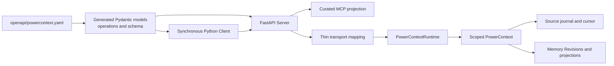
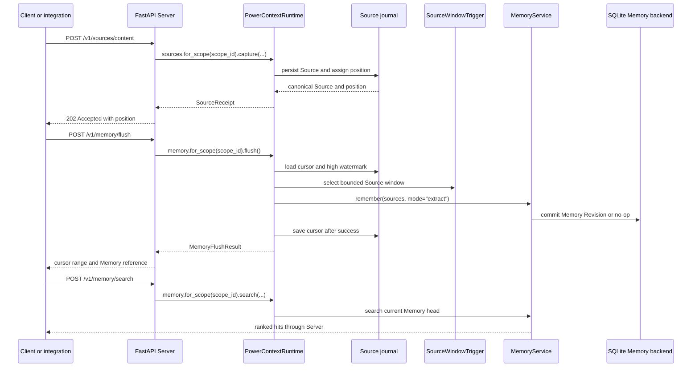

- Proposal Name: `runtime_backed_memory_remote_access`
- Start Date: 2026-07-24
- RFC PR: [oceanbase/powercontext#20](https://github.com/oceanbase/powercontext/pull/20)
- Related RFCs: [RFC 0011](0011_remote_access_architecture.md), [RFC 0019](0019_local_source_memory_runtime.md)

> **Note:** PowerContext now uses bundled sqlite-vec for SQLite vector search. Statements about Vec1 in this RFC no
> longer apply and remain only as a record of the original design.

> **Execution update:** [RFC 1430](1430_distributed_server_workers.md) supersedes this RFC's single-process scheduler,
> synchronous-only flush, and non-durable Operation assumptions. This RFC continues to define the HTTP mapping and
> generated-contract boundary.

# Summary

This RFC defines the first concrete remote API built from the architecture in RFC 0011 and the local Runtime in
RFC 0019. A FastAPI Server exposes Source capture and Memory operations supplied by `PowerContextRuntime`. A
synchronous Python Client calls the HTTP contract. FastMCP projects a selected set of the same HTTP operations as
Agent-facing tools.

The checked-in OpenAPI document is the HTTP source of truth. Generation produces Pydantic wire models, operation
metadata, and the schema served by FastAPI. Server mapping remains thin and calls the scoped application services
from RFC 0019. The Client and MCP projection do not implement Memory behavior.

The first deployment has one trust domain. `scope_id` is an opaque application partition, not a tenant identity or
authorization boundary. Authentication, multi-tenant policy, durable Operations, and Codex plugin packaging are
outside this RFC.

# Motivation

RFC 0011 defines who owns remote contracts but leaves the domain operations open. RFC 0019 defines a working local
Source-to-Memory Runtime but has no remote boundary. Implementing either RFC alone leaves several questions unanswered:

- Which Runtime operations are stable enough to expose over HTTP?
- Which Core values should cross the wire without a parallel transport type?
- How does the Server own Runtime startup, readiness, capability reporting, and shutdown?
- What does a `202 Accepted` Source response guarantee when scheduling is optional?
- Which HTTP operations belong in MCP?
- Which list-shaped results are snapshots, deltas, or ranked top-k results rather than pages?

This RFC answers those questions for the Memory family. It does not add another Source journal, Memory service, Trigger,
or scheduler.

# Guide-level explanation

## Architecture

The Server is an adapter around the local Runtime. `PowerContext` remains the scoped composition root inside that
Runtime.



OpenAPI owns the public JSON shape. Generated code does not own application behavior. The Server translates transport
requests into existing Runtime commands and maps Runtime results back to wire responses.

## Runtime assembly

A Runtime-backed process opens `PowerContextRuntime` inside the FastAPI lifespan. Opening it before the Server event
loop can bind APScheduler to the wrong lifecycle. The required order is:

1. Build Server settings and the candidate pipeline configuration.
2. Enter the FastAPI lifespan.
3. Open `PowerContextRuntime` in that event loop.
4. Bind the Runtime application services.
5. Report Runtime-derived readiness and capabilities.
6. Accept HTTP and MCP traffic.
7. Mark the Runtime unavailable during shutdown.
8. Close the Runtime before the lifespan exits.

The assembly owns the candidate pipeline. An application can inject a pipeline that fits its product semantics. The
standard Server profile can also build `LLMMemoryCandidatePipeline` from a configured Pydantic AI model while keeping
the Memory-owned extraction instructions.

`create_app()` may still build an unbound contract application for schema inspection and adapter tests. Such an
application is not ready for Source or Memory traffic. It must report `not_ready`, and Runtime-backed endpoints must
return `runtime_not_ready`.

The Server CLI and the default MCP application factory always assemble the configured local Runtime. If Runtime
initialization fails, process startup fails instead of exposing a listener that cannot serve Source or Memory
operations. Only the lower-level `create_app()` factory supports an intentionally unbound application.

## Process configuration

Server and Client process configuration uses `pydantic-settings`. `ServerSettings` owns the bind address, SQLite path,
Source window limit, optional schedule interval, generation model, embedding model and profile, inference limits,
Vec1 extension path, and MCP mount. `ClientSettings` owns the Server URL and HTTP timeout.

Vector search configuration is one deployment-fixed tuple: embedding model, profile ID, dimension, normalization, and
Vec1 extension path. The model, profile ID, dimension, and extension path must be configured together. The Server
constructs the Pydantic AI embedding adapter and the matching `EmbeddingProfile`, then passes both to the Runtime.
Runtime startup probes the configured extension and profile before readiness can become `ready`.

Environment variables use the `POWERCONTEXT_SERVER_` and `POWERCONTEXT_CLIENT_` prefixes. Provider credentials remain
under the provider SDK's configuration. Protocol constants, OpenAPI limits, scheduler job identity, and persistence
table names are not deployment settings.

## Source capture and explicit flush

Source capture and Memory extraction remain separate, as specified by RFC 0019.



`202 Accepted` means the Source is durably present in the Source journal and has a stable position. It does not mean a
scheduler is enabled, extraction has started, or a Memory Revision exists.

The returned Source position is a synchronization token. A caller that needs read-your-write processing can call
`flush_memory` until `current_cursor` reaches that position. Each call processes one bounded window. Once the cursor
reaches the captured position, every Source up to that position has been processed successfully. Search then observes
any Memory changes produced by those Sources.

Processing a Source can be a valid no-op. Reaching the Source position does not promise that the candidate pipeline
created an entry.

## Explicit Memory writes

`POST /v1/memory/remember` writes caller-curated Memory content in append mode. It does not create a Source and does
not call the extraction pipeline.

`expected_revision` is either absent or a positive Memory Revision. When it is absent, the write targets the current
head or creates the first Revision. When it is present, the cited Revision must be the current head. A missing Memory
produces `memory_not_found`, and a stale Revision produces `revision_conflict`. Revision zero has no "expect absent"
meaning and is rejected by the wire contract.

Revise and retire operations use an exact `MemoryCitation`. The cited Memory Revision acts as the optimistic
concurrency base. A stale citation produces `revision_conflict`; the Server does not silently apply it to a newer
Revision.

## Query shapes

The first API has three list-shaped query forms, but none is a general page:

| Query | Semantics |
| --- | --- |
| Memory search | Ranked top-k results selected by `limit` |
| Entry list | Complete snapshot of the current Memory head |
| Revision changes | Delta after `since_revision` through the current head |

Search `limit` is not a pagination size. The response has no continuation token, and repeating a search can produce a
different ranking after Memory changes.

The entry list has no page cursor. Its response includes the exact `ArtifactRef` for the Memory snapshot so a caller
can cite the returned values.

The changes query has no page cursor. `since_revision` is an exclusive delta boundary. Revision `0` is the explicit
wire sentinel for complete history because persisted Memory Revisions start at `1`; positive values must identify an
existing Revision of the selected Memory. If change volume later requires pagination, a separate contract must define
a stable upper Revision, a result limit, and continuation semantics.
Revision zero is the baseline before the first persisted Revision, so `since_revision: 0` returns the complete
Revision delta through the current head.

## Python Client

`PowerContextClient` is a synchronous facade over generated operation metadata and generated Pydantic models. It:

- serializes requests with the declared request type;
- requires the operation's declared success status;
- validates successful response bodies;
- preserves stable Server errors and `X-PowerContext-Request-ID`;
- closes only an HTTP client that it created.

The Client does not retry mutations, infer scheduler state, or hide explicit flush behavior. Retries need operation
specific rules because Source capture, Memory mutation, and search have different safety properties.

An asynchronous Client and non-Python SDKs can be added later without changing Server semantics.

## MCP projection

MCP is generated from the assembled FastAPI application, then restricted by an allow-list. The first Agent-facing
tool set contains:

- `search_memory`
- `list_memory_entries`
- `get_memory_entry`
- `remember_memory`
- `revise_memory_entry`
- `retire_memory_entry`

Source capture, explicit flush, and revision changes are excluded. Capture and flush are ingestion or operational
controls. Revision changes are an audit query. They remain available through HTTP and the Python Client.

Health, readiness, and capability discovery are also excluded from the MCP tool list. Adding an HTTP operation never
adds an MCP primitive automatically.

# Reference-level explanation

## HTTP routes

The current HTTP surface is:

| Method | Path | Operation | Success |
| --- | --- | --- | --- |
| `GET` | `/health/live` | `get_liveness` | `200` |
| `GET` | `/health/ready` | `get_readiness` | `200` or `503` |
| `GET` | `/v1/capabilities` | `get_capabilities` | `200` |
| `POST` | `/v1/sources/content` | `capture_content_source` | `202` |
| `POST` | `/v1/memory/flush` | `flush_memory` | `200` |
| `POST` | `/v1/memory/remember` | `remember_memory` | `200` |
| `POST` | `/v1/memory/search` | `search_memory` | `200` |
| `POST` | `/v1/memory/entries/list` | `list_memory_entries` | `200` |
| `POST` | `/v1/memory/entries/get` | `get_memory_entry` | `200` |
| `POST` | `/v1/memory/entries/revise` | `revise_memory_entry` | `200` |
| `POST` | `/v1/memory/entries/retire` | `retire_memory_entry` | `200` |
| `POST` | `/v1/memory/changes` | `list_memory_changes` | `200` |

Memory family operations stay under `/v1/memory/`. Source capture stays under `/v1/sources/`. Process probes are not
versioned domain operations. The MCP Streamable HTTP endpoint is mounted separately at `/mcp/`.

POST is used for structured commands and queries that carry `scope_id`, citations, filters, or mutation content. This
RFC does not treat those requests as CRUD resources.

## OpenAPI and generation

`openapi/powercontext.yaml` is authoritative for:

- paths, methods, operation identifiers, and success statuses;
- request and response schemas;
- error responses and request ID headers;
- descriptions consumed by HTTP documentation and MCP projection.

`make api-generate` produces:

- frozen Pydantic wire models;
- typed operation metadata;
- the canonical OpenAPI schema served by FastAPI.

Generated files are checked in and must not be edited as a substitute for changing OpenAPI. `make api-generate-check`
regenerates sources in memory and fails on drift. The lock file supplies the generator, formatter, FastAPI, Pydantic,
and YAML versions used by the repository.

Core dataclasses are not direct transport models. Their constructors do not enforce OpenAPI constraints such as
`minimum`, required nullable fields, or strict primitive types. Object schemas therefore generate Pydantic models and
map explicitly to Core values. Wire enums are generated in the API layer as well, so importing the Client SDK does not
load Memory, Runtime, or BuiltIn modules. Exact Memory and entry identifiers are validated at the transport boundary as
non-empty, bounded, printable ASCII values before they reach Core or persistence code.

## Core and transport type boundary

The transport owns its search, state, match, and change enums. Generated wire values map to `ArtifactRef`,
`MemoryCitation`, `MemoryChange`, `MemoryRevisionChanges`, and `MemoryHit` at the Server boundary.

An exact Artifact reference has one JSON shape:

```json
{
  "artifact_id": "memory-123",
  "revision": 4
}
```

The API must not introduce a second `MemoryReference` with `memory_id` for the same concept.

An exact entry citation also has one shape:

```json
{
  "memory_ref": {
    "artifact_id": "memory-123",
    "revision": 4
  },
  "entry_id": "entry-7",
  "entry_version_id": "entry-version-9"
}
```

Get, revise, and retire requests wrap this `MemoryCitation` with `scope_id` and any command-specific fields. The
citation already carries the expected Memory Revision.

Transport-only models remain appropriate when the wire adds information that Core does not own:

| Transport model | Reason |
| --- | --- |
| Scope-bearing request | `scope_id` is an application routing value |
| `MemoryEntry` response | Combines an entry version, manifest state, exact Memory reference, and lineage |
| Capture and flush response | Reports journal position or cursor progress |
| Capabilities | Describes assembled Server behavior |
| Error envelope | Defines stable HTTP failure data |

`SourceReference.name` is the stable Source type, such as `content`. `source_id` is the Source identity. Adapter names
are not part of the wire contract. The first Runtime profile supports `ContentSource`; future Source implementations
need an explicit mapping from canonical Source type and identity.

## Thin Server mapping

Server mapping may:

- construct `ContentCapture` from a wire request;
- construct Runtime command values from generated requests;
- combine Runtime entry state and entry version into a response;
- translate Core references without changing their field names.

It may not implement extraction, deduplication, revision selection, cursor movement, search ranking, or Source
identity rules. Those belong to RFC 0019 and the Memory service.

The mapping boundary should use concrete application protocol types. If optional package dependencies make those
imports difficult, the dependency-free application contracts should move to a small module. Using `Any` across the
whole boundary removes useful static checks and is not the target design.

## Scope and trust

Every Source and Memory operation requires an explicit `scope_id`. The Server validates only its basic shape and
passes it to the Runtime unchanged.

The initial deployment assumes that every caller belongs to one trust domain. A caller that knows another
`scope_id` can address it. `scope_id` is therefore not an access token, tenant identifier, or security boundary.

Deployments that accept untrusted network clients need an authentication and authorization RFC before relying on
these routes.

## Error contract

Every response contains `X-PowerContext-Request-ID`. The Server accepts a safe caller-provided value or generates one. The Client
stores it on structured failures.

The first stable error codes are:

| HTTP status | Code | Meaning |
| --- | --- | --- |
| `404` | `memory_not_found` | The requested Memory Revision or entry does not exist |
| `409` | `source_conflict` | A Source identity already has different content |
| `409` | `revision_conflict` | A mutation is based on a stale Memory Revision |
| `409` | `memory_entry_inactive` | A mutation targets an inactive Memory entry |
| `422` | `invalid_request` | The request violates the wire or application contract |
| `422` | `capability_not_supported` | The assembled Runtime cannot perform the requested mode |
| `503` | `runtime_not_ready` | No usable Runtime binding is available |
| `503` | `inference_timeout` | Configured Memory inference exceeded its time limit |
| `503` | `inference_unavailable` | Configured Memory inference is unavailable |
| `500` | `internal_error` | The Server failed without exposing internal details |

Error codes are public wire values. Messages are explanatory and may improve without changing the code.

The Server maps only known validation and domain exceptions to `4xx`. A general `TypeError` or `ValueError` from
mapping or Runtime code is not automatically a client error. Unknown exceptions produce `internal_error` and retain
their traceback in Server logs.

## Readiness and capabilities

Liveness reports whether the HTTP process can answer.

Readiness reports whether the configured Runtime binding can serve its advertised operations. A Runtime-backed
readiness check covers at least:

- application binding presence;
- completed Runtime initialization;
- usable Source and Memory backends;
- shutdown state.

Capabilities come from the same assembly. They report the Source types, Artifact families, search modes, and public
limits actually available. The Server must not combine an unbound application with a ready probe or advertise
capabilities supplied by a different Runtime instance.

The default SQLite profile advertises `auto` and `fts`. A successfully initialized vector configuration additionally
advertises `vector` and `hybrid`. `auto` is a request policy rather than a physical index: the Memory service selects
the strongest available mode and may fall back to FTS according to its stable search contract. The Server never
advertises vector modes from settings alone; Runtime initialization must first accept the matching embedding model,
profile, and Vec1 extension.

Scheduler enablement does not change the capture contract. It may be reported as a capability if callers need to
distinguish scheduled processing from manual flush.

## Lifecycle ownership

The Runtime-backed Server owns resources in this order:

```text
Server lifespan
  -> PowerContextRuntime.open()
      -> Source backend
      -> scoped Memory backends on demand
      -> optional persisted scheduler
  -> accept requests
  -> stop accepting Runtime work
  -> PowerContextRuntime.close()
  -> lifespan exit
```

The HTTP Server does not persist APScheduler jobs or Source cursors. It calls the Runtime that already owns those
details under RFC 0019.

# Drawbacks

The API exposes Runtime concepts such as explicit flush and exact citations. That is more verbose than a single
"remember this" endpoint, but it keeps durable Source acceptance separate from model-driven extraction.

OpenAPI-first development requires generated changes in each contract update. Reusing Core types also needs explicit
compatibility tests because Python import identity alone does not prove wire compatibility.

The snapshot and delta queries are simple, but their response size can grow. Adding pagination later will require a
new compatibility decision rather than reinterpreting existing `limit` or `since_revision` fields.

The first trust-domain model is unsuitable for a public shared service. It is limited to local or otherwise trusted
deployments.

# Rationale and alternatives

## Expose Runtime classes directly

Serializing Runtime dataclasses directly would reduce mapping code, but it would tie wire compatibility to Python
application APIs. Transport-only scope and error data would also leak into Runtime models.

This RFC reuses Core types when their complete semantics match and keeps transport aggregates in OpenAPI.

## Generate Server behavior

Generated handlers could call Runtime methods, but generation would need to understand scope selection, lifecycle,
domain errors, and entry projections. Those rules are small and easier to review as handwritten mapping.

This RFC generates wire models and operation metadata, then keeps behavior in thin Server code.

## Expose every HTTP route through MCP

Mirroring every endpoint would expose ingestion and operational controls to Agents without a use case. It would also
make future HTTP additions change the Agent tool surface by accident.

This RFC uses an explicit MCP allow-list.

## Promise scheduler completion from capture

A `202` response could imply queued execution, but RFC 0019 permits a Runtime without scheduling. Inventing a durable
Operation would also require status, cancellation, retention, and idempotency semantics.

This RFC promises durable Source capture and returns a journal position. Explicit flush supplies the synchronization
path.

## Add pagination now

Entry and change volumes may eventually need pagination. A correct cursor must bind to a stable Memory Revision and
ordering rule. The current Runtime API returns a head snapshot and a Revision delta, so adding page fields only at the
wire layer would give false stability.

This RFC names the current semantics accurately and defers pagination.

# Prior art

The local Mem0 checkout separates memory creation, search, listing, exact reads, updates, and history across HTTP
operations. Its OpenMemory package also exposes a smaller MCP tool surface. This supports reviewing HTTP and Agent
surfaces separately, but Mem0's identity and processing model are not PowerContext contracts.

The local EverOS checkout groups add, flush, search, and get operations under a versioned Memory prefix. Its search
and get endpoints use explicit request and response DTOs. This is useful evidence for family-prefixed command/query
routes, not a reason to copy its owner or pagination model.

The local Acontext checkout uses project and session paths, an explicit session flush, generated OpenAPI artifacts,
and integration-specific Agent tools. It shows that process controls and Agent tools can have different boundaries.
Its skill-memory model does not determine PowerContext Source or Artifact semantics.

These projects informed the interface review. RFC 0011 and RFC 0019 remain the normative basis for this proposal.

# Compatibility

This RFC adds a remote contract around existing Runtime behavior. It does not change Core Source, Artifact, Trigger,
Memory, or `PowerContext` semantics.

OpenAPI request and response shapes become public compatibility surfaces. Renaming a field, changing a success status,
removing an error code, or changing the meaning of `scope_id`, Source position, Memory Revision, or citation requires
normal API compatibility review.

Generated Python model layout is not a public compatibility surface. Public imports and Client facade behavior are.

The Source journal, cursor, scheduler recovery, Memory persistence, and replay behavior remain governed by RFC 0019.
The Server must not weaken those guarantees.

# Acceptance criteria

The implementation is complete when:

- `make api-generate` followed by the repository diff check produces no generated changes.
- `make api-generate-check` and contract tests pass from a locked environment.
- Client import-isolation tests verify that API loading does not import Memory, Runtime, or BuiltIn modules.
- The Server opens and closes `PowerContextRuntime` through its lifespan.
- An intentionally unbound low-level Server reports `not_ready`; production Server and MCP factories assemble a
  Runtime or fail during startup.
- Readiness and capabilities are derived from the bound Runtime assembly.
- The synchronous SDK captures a real Source through HTTP and receives its durable position.
- The SDK flushes until the returned cursor reaches that position.
- SDK search and entry listing read the Memory produced by the real Runtime.
- The returned Memory entry contains Source lineage matching the captured Source type and identity.
- Explicit remember, revise, retire, exact get, and changes work through HTTP against the real Runtime.
- A real MCP client executes at least remember, search, list, and exact get against the same Runtime.
- MCP does not expose capture, flush, changes, health, readiness, or capabilities.
- Source conflicts return `409 source_conflict`.
- Stale citations return `409 revision_conflict`.
- Missing citations return `404 memory_not_found`.
- A wrong Memory identity returns `404 memory_not_found`, while a stale Revision of the correct identity returns
  `409 revision_conflict`.
- Invalid requests return `422 invalid_request`.
- `since_revision: 0` returns the complete ordered Revision delta.
- Unavailable Runtime bindings return `503 runtime_not_ready`.
- Successful and failed responses carry `X-PowerContext-Request-ID`, and the Client preserves it.
- Search results are described as top-k results, entry lists as snapshots, and changes as deltas.
- All Memory reference wire models map exactly to Core `ArtifactRef`, and exact entry operations map through
  `MemoryCitation`.
- Explicit remember rejects revision zero and preserves missing versus stale Revision errors.
- Source capture promises durable journal acceptance without promising scheduler execution.
- RFC 0019 restart tests still recover the Memory head, Source lineage, cursor, and persisted scheduler job.
- RFC 0019 replay tests still handle Memory commit success followed by cursor commit failure.

# Out of scope

This RFC does not define:

- authentication or authorization;
- multi-tenant isolation;
- a durable Operation resource or job status API;
- distributed workers, claims, leases, or exactly-once processing;
- another Source type beyond the local Runtime profile;
- model provider selection or extraction prompts;
- an asynchronous Python Client or non-Python SDK;
- Codex plugin manifests, installation, or packaging.

# Unresolved questions

- Should scheduler enablement appear in `Capabilities`, or is readiness plus explicit flush sufficient?
- When entry snapshots become large, should pagination use entry identity or a manifest position?
- Should the Client offer a helper that repeats flush until a captured Source position is processed?

# Future possibilities

A later RFC can add authentication and tenant-aware scope authorization without changing Memory and Source semantics.
Another proposal can add durable Operations if capture needs observable background completion across workers.

Pagination can be added once the cursor binds to an exact Memory Revision and ordering rule. Additional SDKs can be
generated from the same OpenAPI contract after the HTTP surface has conformance coverage.

Codex plugin packaging can follow after the MCP tools, Server lifecycle, and trust model are stable enough for
installation outside a developer checkout.
