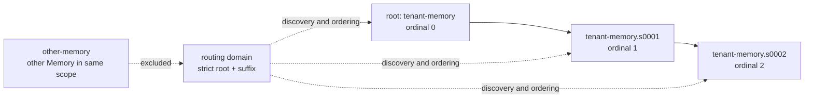

- Proposal Name: `memory_capacity_and_sharding`
- Start Date: 2026-08-28
- RFC PR: [oceanbase/powercontext#1387](https://github.com/oceanbase/powercontext/pull/1387)

# Summary

This RFC introduces entry-count-bounded shards for flat-v1 Memory, plus a routing domain centered on the configured root Artifact ID. One logical Memory may consist of multiple non-migrating Memory Artifact shards; each shard continues to use the existing Artifact Revision, manifest, immutable entry versions, active-head projection, and head CAS.

Pure unconditional adds may automatically advance to the next shard once capacity is reached. Writes carrying `expected_revision`, citation-driven revise/retire/reactivate, and citation-driven organize all retain their original shard identity and return a stable capacity error when capacity is insufficient. Source flush observes all current heads of the routing domain in a single plan, performs candidate generation and exact deduplication over the full active-entry union; revise candidates commit in place on their owner shard, add candidates route to the write-target shard, and all affected shards plus the Source cursor commit in one outer transaction.

This RFC does not change the flat-v1 persistence shape, does not migrate historical entries, does not physically delete old Revisions, and does not turn scope or routing domain into a new Core identity. It addresses the capacity and read-amplification problems that the current single-Artifact manifest develops as entries grow.

# Motivation

RFC 0014 defines Memory as a lifecycle of immutable Artifact Revisions, with the manifest as the authoritative directory of current entry state. The current implementation writes the complete directory into every new Revision on append; consecutive adds therefore persist 1, 2, …, N-entry directories, and storage and write amplification grow quadratically. `entries()` and `changes()` also read the complete manifest or complete history as a single unit, becoming unbounded single operations as data grows. While preserving RFC 0014's semantics of a manifest as a full snapshot, this RFC caps the extreme cases driven by unbounded growth, preventing unbounded storage and write amplification.

This RFC aims to:

- preserve the Memory flat-v1 design, capping storage and write amplification at a suitable place;
- confine add pressure to a single shard, with a deterministic next shard when needed;
- preserve the immutable semantics of entry identity, entry versions, and citations;
- make flush's candidate context and exact deduplication cover the routing domain, not a single shard;
- keep cross-shard revise on its original owner shard, and give multi-shard flush all-or-nothing commit semantics;
- bind list and changes to an immutable Revision as the snapshot boundary;

# Guide-level explanation

## Shards and the routing domain

A scope's configuration designates a `root_artifact_id` for Memory. The root itself is ordinal 0; automatically created follow-up shards use IDs like `root.s0001`, `root.s0002`. Only the root and strict suffixes matching that root belong to the same routing domain; other Memory Artifacts under the same scope are not included merely because their family is `memory`.



A shard is a storage and concurrency boundary, not a new logical entry identity. Once an entry lands in a shard, its `memory_artifact_id` is fixed; subsequent revise, retire, reactivate, and citation all use that shard's exact ArtifactRef. Split only decides where new entries are written; it never moves old entries.

## Write behavior

When the caller performs an unconditional pure append, the Runtime selects the shard with the highest ordinal. If the planned manifest would exceed `memory_manifest_max_entries`, the Runtime re-plans the entire batch of adds onto an empty shard at the next ordinal. Re-planning the whole batch, rather than squeezing part of the entries into the old shard, guarantees that exact content deduplication within one request cannot fail due to partitioning.

The following operations never silently switch shards:

- explicit remember carrying `expected_revision`;
- revise, retire, reactivate targeting an exact citation;
- organize against a specified Memory.

When capacity or identity requirements are not met, these operations return a stable `memory_capacity_exceeded`, so the caller sees the failure reason instead of having conditions pinned to an old Revision quietly applied to a different Artifact.

## Flush: single-shard semantics extended

Source flush first reads all current heads of the routing domain. The candidate pipeline receives the active entries of all shards at once; its input is not truncated by this RFC, and candidate rules do not change with shard count. When the model proposes a revise, it must specify both `memory_artifact_id` and `entry_id`; an add carries no target identity.

Candidate processing follows these semantics:

1. a revise target must be an exact current entry in this snapshot, and commits back to the shard it belongs to;
2. an add uses the highest-ordinal shard as its write target;
3. the active canonical `content_bytes` of all shards form the global deduplication set; the hash only accelerates, and a hit still compares canonical bytes;
4. all candidates in one batch share and update this global set;
5. each affected shard produces one ordinary Memory commit; all commits and the source cursor commit or roll back together.

For example, `tenant-memory` already holds old facts while `tenant-memory.s0001` is the current write target: the model may revise an old fact in the root and simultaneously add a new fact in s0001. Both changes land on the owner shard and the write-target shard respectively, and the citation identity of the entries does not change.

## Bounded reads

list and changes do not track the moving head; they bind to an exact immutable Revision:

- list filters by state within a fixed Revision and paginates by `entry_id`;
- changes paginates by revision within a fixed target Revision of a fixed shard;
- a cursor binds scope/root, family, the exact target ref, filter conditions, and a fixed page size, and cannot be replayed across routing domains;
- to read a scope's complete content or history, the caller first enumerates the routing domain and then paginates each shard independently.

This means shards, Revisions, entries, or reactivations created during pagination do not mix into an existing cursor chain. The caller must re-enumerate routing to see the new snapshot.

## Inactive tombstone compaction

Inactive entries remain in the current manifest until an ordinary write triggers compaction. Compaction only removes inactive items not part of the current batch's business changes from the new Revision, auditing the action with a `drop` change; old Revisions, old entry versions, and old citations remain resolvable. Entries retired within the current batch are retained for at least one Revision, so a mutation response does not immediately lose its target after commit.

`drop` is an audit operation for manifest compaction, not a physical deletion, and it must not be treated as a return target of a user business change.

# Reference-level explanation

## Invariants

### Identity

- Memory's persistent identity remains `(family, artifact_id)`; the routing domain is only a discovery set derived from the configured root.
- Shard ID resolution first matches the exact root, then applies a strict `root.s([1-9][0-9]*)` full match; ordering uses the parsed integer, forbidding accidental prefix matches.
- The root, suffixes, and entry/version IDs continue to obey the existing identifier length and ASCII constraints. Generating a suffix that exceeds the limit returns `split_id_exhausted`.
- `MemoryEntryVersion.memory_artifact_id`, the manifest entry pointer, and the citation's `memory_ref` must all point to the same shard.

### Manifest and versions

Each shard continues to use flat-v1: the manifest stores only `entry_id`, `entry_version_id`, `entry_content_hash`, and `state`; bodies live in immutable `MemoryEntryVersion`. The final manifest's entry count must not exceed `memory_manifest_max_entries` (default 200, `ge=1`); entry count is the capacity dimension.

The default of 200 is grounded in: the heaviest real growth scenario in this repository is the LoCoMo benchmark (tens to low hundreds of accumulated entries per scope, with an even smaller runtime retrieval working set — `PreparedContext` injects 8 entries per call, rerank candidates are capped at 30, and the source window is 100). Empirical measurement shows the cost at N=200 is known and acceptable (one manifest rewrite of roughly 44 KiB, end-stage write latency of roughly 112 ms); extrapolating to N=500 costs about 6x, prepaying for a scale real workloads almost never reach. The default is an initial calibration, not a performance or storage guarantee, and is subject to scale testing.

### Candidate identity

The current baseline extraction builds the `current_entries` mapping and `revised_entries` set from bare `entry_id`. In a multi-shard setting, this would mis-identify same-named entries in two shards as the same target. The proposed model semantics:

```text
MemoryExtractionCurrentEntry:
    memory_artifact_id
    entry_id
    kind
    text

MemoryExtractionCandidate:
    intent: add | revise
    kind
    text
    evidence_ids
    memory_artifact_id: string | null
    entry_id: string | null
    reason
```

An add must omit both target fields; a revise must supply both. The pipeline mapping uses:

```text
entry key          = (memory_artifact_id, entry_id)
version membership = (memory_artifact_id, entry_version_id)
```

Targets must belong to the validated current entries of this snapshot's exact heads; unknown owners, bare targets, old-Revision targets, or cross-shard versions are rejected as untrusted candidates. Ordinary `MemoryEntryInput` is produced only after the mapping succeeds — a bare ID output by the model must never enter a commit directly.

## Capacity and compaction

All write paths that construct a new Memory Revision apply the same final rule to the resulting manifest: first compact droppable inactive tombstones according to the threshold and capacity conditions, then check `len(final_manifest) <= memory_manifest_max_entries`. The capacity check happens before embedding/projection preparation; a failure writes no Artifact, entry, projection, or index.

`memory_tombstone_compaction_threshold` controls whether compaction is triggered by tombstone count, and `memory_compaction_max_drops` only bounds the internal drop batch of one Revision; it does not limit the number of remember or candidate inputs. Legitimate large batches are not implicitly truncated; only a final manifest over budget fails as a whole.

The stable error:

```text
HTTP: 413 Payload Too Large
code: memory_capacity_exceeded
reason: manifest_entries | split_id_exhausted
```

## Flush transaction and concurrency

Comparing the set of heads before and after planning is not enough to protect shards used only as candidate/dedupe context. Flush must lock the entire routing domain:

- when the root exists, lock the root head row right after the outer transaction begins, then read all legal shard heads by ordinal;
- when the root does not exist, protect bootstrap with a database-supported `SERIALIZABLE` or equivalent predicate-conflict mechanism; a non-existent row is not a lockable object;
- every writer that changes the routing domain — explicit shard writes, split, flush, organize, and new-shard creation — first acquires the same barrier;
- head reads, candidate generation, global deduplication seeding, per-shard plans, ordinal-ordered apply, and cursor save all use the same bound connection;
- when the backend cannot support row locks and reliable bootstrap isolation, multi-shard flush is not enabled, rather than degrading to an unprotected head re-check.

The success order:

```text
routing barrier
  -> exact heads and active union
  -> one candidate extraction
  -> qualified per-shard plans
  -> ordinal-ordered commits
  -> source cursor save
  -> outer commit
```

Any CAS, lock, serialization, candidate-validation, or capacity error rolls back all shard changes and does not advance the cursor. Per-shard CAS remains; the barrier is a stable-read protection and does not replace the persistence layer's conditional-write validation.

## API semantics

This RFC needs to expose the following concepts over Runtime/HTTP, without requiring transport naming to match implementation files:

- routing enumeration: returns the root, each legal shard's exact head, ordinal, entry/active counts, and a writable hint;
- list entries: optional exact `memory`, `limit`, and opaque `next`, returning a fixed shard snapshot;
- list changes: optional exact `memory`, `since_revision`, `limit`, and opaque `next`, returning a fixed shard history page;
- flush result: keeps the compatible `memory_ref`, and adds the `memory_refs` of shards touched this time;
- `EntryChangeOperation` gains `drop`;
- the capacity error and its stable reason/details.

`memory_ref` remains the authoritative identity for exact citations; a page-level memory in a response is only a hint about that page's snapshot. A scope-level full read is not a pseudo-snapshot stitching multiple shards into a single Revision.

## Boundary against the baseline

The existing `MemoryService._candidates()`, `_prepare_commit()`, `LLMMemoryCandidatePipeline.extract()`, and `MemoryBackend` are all centered on a single `Memory`/single commit. The implementation must add routing-aware orchestration and a multi-commit plan above these boundaries, but must not bypass the existing `_claim_revision_target()`, canonical bytes, manifest hash, or backend CAS by letting `MemoryEntryInput` carry unvalidated shard strings.

## Compatibility and migration

- No database schema migration is needed; the existing root automatically becomes ordinal 0.
- Illegal suffixes or other Memory Artifacts in the same scope are not automatically absorbed into the routing domain, avoiding changes to the existing identity set.
- The MemoryService lifecycle for single-shard calls keeps its original semantics; the new routing, pagination, and cross-shard flush are extended or tightened Runtime/API contracts.
- list/changes changing from returning complete results to bounded pages is an intentional behavior change; older clients should adapt via routing and cursors.
- `since_revision` no longer represents a unified progress across multiple shards. When no memory is specified, it still applies only to the configured root, so old calls are not silently reinterpreted as cross-shard queries.
- Historical citations remain readable at their old exact Revision even after an entry is dropped by compaction; the current head no longer allows reactivate/revise through dropped entries.

# Drawbacks

- Shard count, routing, the barrier, and multi-commit transactions increase Runtime, backend, and API complexity.
- The flush's full active-entry union grows with shard count, and the candidate pipeline's tokens, latency, and model-context pressure grow with it; this is not introduced by this design.
- Each shard is still written as a complete flat-v1 manifest; the historical accumulated bytes of revision-heavy workloads have no hard upper bound.
- list/changes clients must understand routing and per-shard checkpoints instead of a simple global list or integer progress.
- Tombstone drop changes what the current manifest can address, although it does not break old exact citations.

# Rationale and alternatives

## Only rejecting over-capacity writes

Rejecting every over-capacity append is the simplest option, but Memory would become permanently unable to accept new entries after reaching the limit; callers would have to manually create and bind new Artifacts, and different clients would diverge into inconsistent routing rules. This RFC provides automatic split only for unconditional pure adds and keeps explicit failure semantics for conditional writes.

## Not choosing a flat-v2 manifest

A flat-v2 delta manifest could suppress both axes at once, but it would change the canonical hash, turn the manifest into a checkpoint chain, and strip the exact Revision pinned by a citation of its RFC-0014-decided property of being a complete self-contained manifest. The shard scheme does not touch the flat-v1 persistence shape or citation semantics at all. Sharding first, flat-v2 later if necessary.

## Moving old entries to a new shard

Migration would change `memory_artifact_id`, making old citations, entry version ownership, projection foreign keys, and audit history hard to keep in their original meaning. In-place revise with only new adds going to the new shard preserves stable identity, so migration is not adopted.

## Follow-head keyset for scope-level pagination

Heads insert new entries at the front during pagination; continuing reads by `(ordinal, entry_id)` cannot recover skipped items. Fixing an exact Revision requires an independent cursor per shard, at the cost of one extra routing call for the caller, but the semantics are provable and replayable.

## Calling the candidate pipeline once per flush shard

Per-shard invocation would lose cross-shard context, and exact deduplication could not prevent cross-shard duplicates. One complete input, partitioning by target, and a multi-commit transaction preserve the single-shard pipeline semantics.

## Simple capacity-triggered tombstone cleanup

Dirty-ratio- and tombstone-age-based triggers were considered, but tombstone age introduces extra complexity and compatibility problems. Pressure triggering already clears whatever tombstones it can when hitting the wall, covering the dirty-ratio scenario.

# Prior art

- Continues RFC 0014's flat-v1, immutable Revision, entry version, active-head projection, candidate pipeline, and exact citation.
- Continues RFC 0019's Source cursor, scope lock, and flush retry.
- Continues RFC 0020's exact reference and transport-mapping layering.

# Unresolved questions

- The defaults for `memory_manifest_max_entries`, the tombstone threshold, and the drop batch need calibration through scale testing; the defaults are not performance or storage guarantees.
- Pagination, caching, and permission policies for the routing endpoint are undefined; this RFC does not promote scope to an authorization boundary.
- Whether scope-level atomic snapshots, cross-shard merge, or historical Revision archiving are needed should be proposed in separate RFCs.
- Whether the pipeline itself should report a capability error when the model context is insufficient during multi-shard flush, or whether an independent explicit-window/retrieval mechanism should solve it, is not decided in this RFC.
- The root cause of storage and write amplification is that the flat-v1 manifest stores all entries; this RFC does not solve the root cause.

# Future possibilities

Later designs may add an incremental manifest (e.g. flat-v2), Revision history archiving, or controlled cleanup to govern the accumulated storage of revision-heavy workloads; shard merge/routing policy may be designed, but citation, concurrency, and history-compatibility semantics must be defined first.

A future scope-level snapshot token could give clients a consistent cross-shard read view, but it would introduce a new snapshot lifecycle, storage, and concurrency protocol, and does not belong to this RFC's exact per-shard snapshot scheme.

# Acceptance criteria

- Every new Revision's final manifest applies the unified entry budget and tombstone compaction rules; a capacity failure leaves no persistence side effects.
- Default root, custom root, a root that already carries suffixes, illegal suffixes, over-length split IDs, and non-domain Memory Artifacts all have well-defined outcomes.
- Unconditional pure-adds that fill a shard move to the next shard as a whole batch; CAS writes and citation operations never silently switch shards.
- Multi-shard flush sees the full active union; with same-named IDs across shards, only the specified owner can be revised; global canonical-bytes deduplication produces no exact cross-shard duplicates.
- A mixed revise/add flush commits on the respective owner shards; all per-shard commits and the Source cursor commit atomically, and any failure rolls back everything.
- The routing barrier covers the entire flush from head reads to cursor save; concurrent bootstrap with a missing root never produces two valid roots.
- list/changes cursors bind to exact immutable shard snapshots, paginating without duplicates or omissions, and reject replay across scope/root/family.
- `drop` is auditable and does not break old citations; mutation responses do not treat drop as a business target.
- search, prepare context, statistics, and citation lifecycle handle identity consistently across legal root shards.
- Legitimate large remember/candidate batches are not truncated by an artificial 100-item limit; only the final manifest budget applies.
