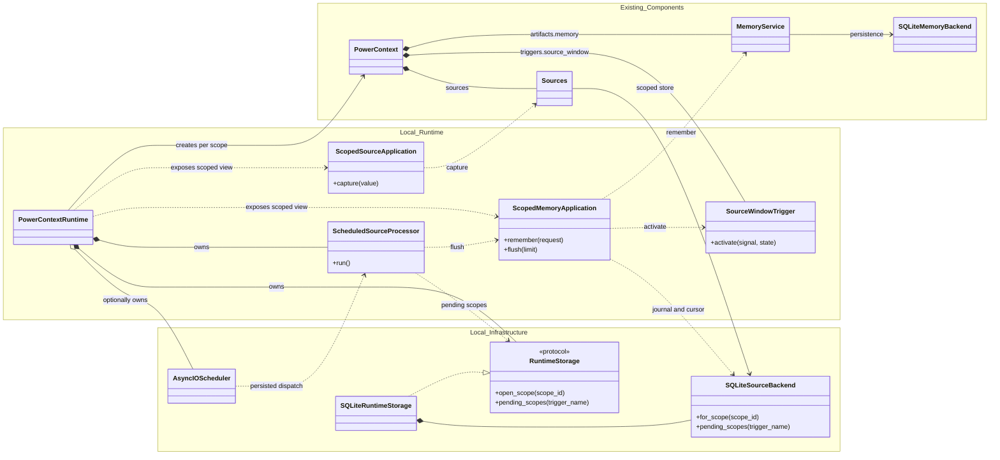
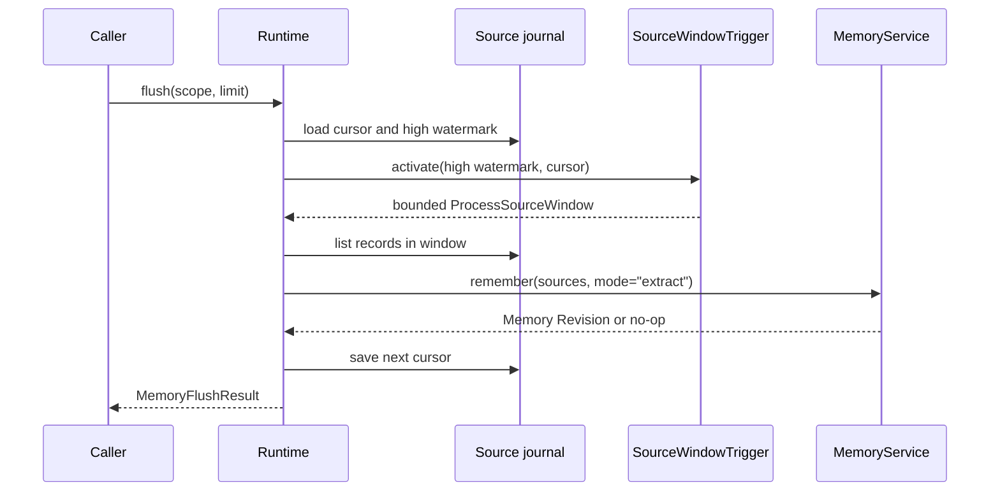

- Proposal Name: `local_source_memory_runtime`
- Start Date: 2026-07-24
- RFC PR: [oceanbase/powercontext#19](https://github.com/oceanbase/powercontext/pull/19)

> **执行更新：** [RFC 1430](1430_distributed_server_workers.md) 使用同一套数据库 Work Ledger 替代 APScheduler
> sidecar 和单进程执行假设，并同时服务本地与分布式模式。本 RFC 仍负责 Source window、cursor、Memory 和领域提交语义。

> **注意：** PowerContext 当前使用随 builtin 依赖捆绑的 sqlite-vec 提供 SQLite 向量检索。本 RFC 中关于 Vec1 的
> 表述已不再适用，仅作为原始设计记录保留。

# Summary

本 RFC 提议 backend-neutral Runtime storage contract 和一个内置 SQLite profile。Runtime 使用 `PowerContext`
组合根组装 scoped Source、Memory Artifact Family 和 `SourceWindowTrigger`。SQLite profile 将 Source journal、
Trigger cursor、Memory binding 和 Memory Revision 保存在 Runtime database 中；APScheduler 使用独立的 SQLite
sidecar。

Runtime 提供两条独立路径。显式 Memory 写入直接调用 `MemoryService.remember(mode="append")`。Source capture
只保存原始工作材料，之后由手动 `flush()` 或定时 activation 调用
`MemoryService.remember(mode="extract")`。Source 写入本身不会隐式生成 Memory。

本 RFC 选择单进程、at-least-once 的本地执行语义。它不引入 Workflow store、claim、lease、分布式调度或
exactly-once 保证，也不把 Agent turn、task outcome 等产品事件固化成默认 Source 类型。

# Motivation

[Core Protocol](../development/core-protocol.md) 已经定义 Source、Artifact、Trigger 和 `PowerContext` 组合方式，
[Memory Layer](../development/memory-layer.md) 也已经提供 Memory 的持久化、检索、Revision 和候选提取能力。
目前缺少的是一个具体 Runtime，用来回答以下问题：

- 一个业务 scope 如何得到 Source、Memory 和 Trigger 的组合实例；
- 捕获的 Source 在何时进入 Memory candidate pipeline；
- Trigger State 保存在哪里，失败后从哪里恢复；
- 定时器如何触发 Runtime，又不接管 domain state；
- Source 和 Memory evidence 如何在 SQLite 中保持可恢复的精确引用。

如果每个 Server、CLI 或 Agent integration 都自行解决这些问题，它们会逐渐形成不同的 scope 规则、cursor
语义和失败恢复方式。反过来，如果把这些规则放进 Core Protocol，Core 又会依赖 SQLite、APScheduler 和具体
Memory profile。

本 RFC 把这些选择放在一个可选的 integration Runtime 中。上层可以本地调用它，也可以在后续方案中通过 HTTP
或 MCP 暴露它。Core Protocol 和 MemoryService 不需要知道 transport 或 process topology。

# Guide-level explanation

## Runtime 组合

调用方通过 `PowerContextRuntime.open()` 创建 SQLite profile：

```python
runtime = await PowerContextRuntime.open(
    "powercontext.db",
    candidate_pipeline=candidate_pipeline,
    source_window_limit=100,
    schedule_seconds=30,
)
```

其他 storage profile 实现 `RuntimeStorage`，并通过 `PowerContextRuntime.assemble()` 组装。Runtime orchestration
依赖 `RuntimeStorage` 与 `RuntimeScopeStorage`，不依赖具体 Source 或 Memory backend。

owning application 可以注入 `candidate_pipeline`。未配置 pipeline 的 Runtime 仍支持显式 Memory 写入、读取和全文
检索。此时处理非空 Source window 会报告 extraction 不可用，并且不推进 cursor。scheduled Source processing 在启动
时必须已经配置 pipeline。Runtime 不提供测试专用的 task outcome 或 working note 默认类型，也不替调用方选择生成模型。
没有稳定产品语义时，Runtime 不应猜测一段 Source 应该成为 fact、decision 还是 working note。

Embedding 是另一项独立的可选能力。owning application 提供 `EmbeddingModel`；SQLite profile 同时接收与其严格匹配的
`EmbeddingProfile` 和 Vec1 extension path。Runtime 只把这些组件传给 `MemoryService` 和 backend，不选择 provider、
读取 credential，也不在运行时切换 profile。

Runtime 使用 `scope_id` 选择 application service：

```python
project_sources = runtime.sources.for_scope("project:powercontext")
project_memory = runtime.memory.for_scope("project:powercontext")
```

scope 是 integration-owned 的不透明字符串。Runtime 不把 repository、session、tenant 或 Agent turn 提升成 Core
概念。对每个 scope，Runtime 延迟创建以下组合：



图只保留 orchestration boundary。`Existing_Components` 是本 RFC 复用的既有能力，`Local_Runtime` 是新增的
application 与 Trigger 逻辑，`Local_Infrastructure` 负责持久化和时间唤醒。为保持可读性，图将 typed component
group 折叠到 `PowerContext` 的两条关系中，并省略 selector facade、catalog、adapter、codec、DTO、record 和 lock
等实现细节。

新增类形成四条调用链：

| 入口 | 调用链 | 结果 |
| --- | --- | --- |
| Source capture | `SourceApplication` → `ScopedSourceApplication` → `Sources` → `SourceCatalog` / `SQLiteScopedSourceBackend` | adapter 解析输入，backend 持久化 canonical Source 和 journal sequence |
| 显式 Memory command | `MemoryApplication` → `ScopedMemoryApplication` → `MemoryService` → `SQLiteMemoryBackend` | 以 `append` 模式提交调用方已确认的 Memory entry |
| 手动 Source flush | `ScopedMemoryApplication` → `SQLiteScopedSourceBackend` → `SourceWindowTrigger` → `MemoryService` | 读取 bounded window，以 `extract` 模式提交 Memory，成功后保存 cursor |
| 定时 Source flush | `AsyncIOScheduler` → `dispatch_source_windows()` → `ScheduledSourceProcessor` → `MemoryApplication` → `ScopedMemoryApplication.flush()` | 恢复持久化 job，查找 pending scope，并复用同一条 flush 链路 |

`PowerContextRuntime` 不是新的 domain 组合根。它持有进程级资源，并按 `scope_id` 创建和缓存 `_ScopedRuntime`；
`_ScopedRuntime.context` 中的 `PowerContext` 才是 Source、Memory Artifact Family 和 Trigger 的实际组合根。

同一个 scope 通过 Runtime-owned `MemoryBindingStore` 对应一个稳定、全局唯一的 Memory Artifact identity。
SQLite profile 持久化这一一对一 binding。不同 scope 使用同一个 Runtime database，但它们的 Source journal、
cursor、Memory identity 和 mutation lock 相互隔离。

## 显式 Memory 写入

调用方已经知道要保存的语义时，应直接写入 Memory：

```python
result = await project_memory.remember(
    RememberMemoryRequest(
        entries=(
            MemoryEntryInput(
                kind="decision",
                text="Use SQLite for the local Runtime profile.",
            ),
        ),
        expected_revision=None,
    )
)
```

这条路径调用 `MemoryService.remember(mode="append")`。它不创建 Source，也不调用 candidate pipeline。调用方可以
提供 expected revision 来检测陈旧写入。内容没有形成实际变化时，MemoryService 可以返回相同 Revision；Runtime
不会伪造一条新 entry。

显式写入适合用户确认的 decision、constraint 或 handoff。它不应该为了统一流程而先包装成虚构的 Source。

## 捕获 Source

上层 integration 可以先保存实际工作材料：

```python
receipt = await project_sources.capture(
    ContentCapture(
        source_id="task-2026-07-24",
        content="The Runtime uses a persisted APScheduler interval job.",
        metadata={"origin": "integration"},
    )
)
```

`ContentCapture` 是 integration input，`ContentSourceAdapter` 将它解析为 Core `Source` 的具体实现
`ContentSource`。`ContentSource.name` 使用调用方提供的稳定 `source_id`，Source type 使用公共名称 `content`。

`capture()` 只完成以下工作：

1. 解析 `ContentCapture`；
2. 持久化 `ContentSource`；
3. 为该 scope 分配单调递增的 journal sequence；
4. 返回 canonical Source 和 sequence。

`ContentCapture` 将 metadata 校验为 JSON，并在构造时保存快照。返回的 `ContentSource` 不与调用方持有的可变
container 共享状态。content、description 和 metadata 共同组成 canonical Source payload。

相同 scope、Source type 和 Source identity 再次写入相同 canonical payload 时，capture 是幂等的。相同 identity
对应不同 payload 时，Runtime 返回 `SourceConflictError`。这种冲突不能通过生成一个新 identity 静默绕过。

Source persistence 不依赖 adapter 才能执行 `get()` 或 `list()`。adapter 只负责 `resolve()` 和 `read()`，不拥有
持久化 Source 的身份。

## 手动处理 Source window

调用方可以显式处理下一段 Source journal：

```python
flush = await project_memory.flush(limit=100)
```

处理链路如下：



`SourceWindowTrigger` 是纯策略。它根据当前 cursor、journal high watermark 和 window limit 选择下一段非空窗口。
Trigger 不访问数据库，不调用模型，也不执行 Action。

Runtime 在同一个 scope lock 中读取状态、执行提取并保存 cursor。candidate pipeline 看到完整的 canonical Source，
可以根据现有 Memory head 生成候选。整个窗口成功后 cursor 才会推进。提取没有产生 Memory 变化也属于成功，因为
Runtime 已经检查过这段 Source。

如果当前 cursor 已经到达 high watermark，`flush()` 返回 idle result，不创建空 Memory Revision。

## 定时处理

设置 `schedule_seconds` 后，APScheduler 定期激活相同的 flush 路径。APScheduler 不直接决定 Source window，也不保存
Trigger cursor。

SQLAlchemyJobStore 把 interval job 保存到独立的 SQLite sidecar。持久化 job 使用稳定的 module-level async
callable。job argument 只包含规范化后的 Runtime database key，不包含 `PowerContextRuntime`、candidate pipeline
或 bound method。

进程启动时，Runtime 先注册 database key 对应的 processor，再以 paused 状态启动 scheduler，恢复或校正固定 job，
最后恢复调度。进程关闭时，Runtime 先停止 scheduler，等待正在运行的 processor 退出，然后关闭 Memory 和 Source
backend。

这种设计允许 scheduler job 在进程重启后继续存在，同时避免把不可移植的 application object 写入 job store。

# Reference-level explanation

## 公开边界

本 RFC 增加以下 public runtime surface：

| 类型 | 作用 |
| --- | --- |
| `PowerContextRuntime` | 持有本地资源和 scoped application service |
| `RuntimeStorage` | 创建 backend-neutral scope storage 并列出 pending scope |
| `RuntimeScopeStorage` | 提供一个 scope 的 Source backend、Memory backend、evidence codec 和 lifecycle |
| `MemoryBindingStore` | 解析 scope 对应的稳定 Memory Artifact identity |
| `SourceApplication` | 选择 scoped Source service |
| `ScopedSourceApplication` | 捕获 `ContentSource` |
| `MemoryApplication` | 选择 scoped Memory service |
| `ScopedMemoryApplication` | 执行 Memory command、query 和 Source flush |
| `ContentCapture` | integration 提供的 captured text input |
| `ContentSource` | 具备 Core Source 语义的 captured text |
| `SourceWindowTrigger` | 计算下一个 bounded Source window |

具体 persistence schema、cursor row、scheduler registry 和 Pydantic evidence payload 都是当前 SQLite profile
的实现细节。storage protocol 定义 adapter boundary，但不会把 SQLite schema 提升为通用 Source、Trigger 或
transport contract。

`BuiltinArtifacts` 是 `PowerContext` 中的 typed Artifact group；Source-window application 直接作为 Trigger
component 绑定。两者都不会引入全局 Artifact 或 Trigger catalog。

## 初始化

`PowerContextRuntime.open()` 只有在 SQLite Source schema、Memory binding store、Memory schema 和 FTS5 projection
均成功初始化后才返回。配置 embedding profile 时，启动还会加载并探测匹配的 Vec1 extension。非法 window、scheduler
或 vector 配置会在 Source storage 打开前被拒绝。上层进程的 readiness 因此可以依赖成功打开的 Runtime，而不必等到
第一个 scoped request 才发现 Memory backend 不可用。

## Scope 与 Memory identity

scope 必须是非空字符串，最大长度为 256。Runtime 将它作为 application partition key，不解析其中的业务结构。

`MemoryBindingStore` 持久化 `scope_id` 到全局唯一 Memory Artifact ID 的一对一映射。重启后解析已有 scope 会返回
相同 ID；两个独立 store 不会仅仅因为调用方使用相同 scope 字符串而产生相同 identity。binding 的存在表示 identity
已经保留，不代表 Revision 1 已经存在。

binding 只用于定位该 scope 的 Memory head。Memory Revision、entry identity 和 evidence lineage 继续使用 Memory
Layer 的既有约束。当前 profile 仍然让一个 scope 只有一个 Memory Artifact；支持多个 instance 需要显式扩展
application mapping。

## Source journal

Runtime storage 持有三类 scoped state；SQLite profile 分表持久化：

| State | Partition | 约束 |
| --- | --- | --- |
| Source journal | `scope_id` | sequence 单调递增 |
| Trigger cursor | `scope_id + trigger_name` | cursor 只能前进 |
| Memory binding | `scope_id` | Artifact ID 稳定且唯一 |

Source identity 在同一 scope 内由 Source type 和 Source name 确定。journal sequence 是处理位置，不是 Source identity。
同一 Source 的幂等重放返回原有位置，不追加新的 journal record。

`pending_scopes()` 比较每个 scope 的最大 journal sequence 和已保存 cursor。Scheduled processor 只处理仍有未消费
Source 的 scope，并在某个 scope 失败后继续尝试其他 scope。

## Pydantic persistence boundary

`ContentSource` payload 使用 `TypeAdapter(ContentSource).dump_json()` 和 `validate_json()` 编解码。Runtime 不维护一套
手写 JSON field parser。

Source evidence reference 使用私有的严格 Pydantic schema，字段包括 scope、Source type 和 Source identity。解码后，
backend 再读取 canonical Source。调用方不能通过 evidence payload 注入一份未持久化的 Source。

Artifact evidence 在 public boundary 继续使用 Core `ArtifactRef`。私有 schema 只负责严格检查持久化数据，成功后返回
Core object，不增加 `TaskOutcomeReport` 或其他平行 Artifact reference 类型。

APScheduler job state 由 APScheduler 自己序列化。它属于受信任的本地数据库状态，不应从不可信数据库文件加载。

## Trigger transition

`SourceWindowTrigger.activate()` 接收：

```text
Signal: SourceHighWatermark(sequence, limit)
State:  SourceCursor(sequence)
```

当 high watermark 不大于 cursor 时，transition 没有 Action，State 保持不变。否则：

```text
through = min(high_watermark, cursor + limit)
next_state = SourceCursor(through)
action = ProcessSourceWindow(after=cursor, through=through)
```

Trigger 返回的 next State 只有在 Action 成功后才由 Runtime 保存。纯 Trigger 不声称已经执行 Action。

## 并发与生命周期

Runtime 使用四层本地同步：

- lifecycle gate 在 shutdown 开始后拒绝新的 application operation，并允许已经准入的 operation 在 backend
  关闭前完成；
- scope lock 串行化同一 scope 的 remember、revise、retire 和 flush；
- processor lock 防止 scheduler processor 与 Runtime close 竞争；
- backend lock 保护同一 APSW connection 的同步访问。

shutdown 先暂停调度并关闭 lifecycle gate，然后等待已准入的 application operation 和 active processor，最后才
关闭 APScheduler 与 backend。APScheduler 不得取消 Runtime 已经准入的 Source window。`close()` 是幂等的；如果
前一次等待被调用方取消，可以再次调用以完成清理。

SQLite Runtime connection 启用 WAL 和 busy timeout。SQLAlchemyJobStore 使用独立 sidecar，避免其 pysqlite
connection 与 APSW 争用 Runtime state。

一个 runtime database file 只由一个 live `PowerContextRuntime` 持有。实现会主动拒绝同一进程为同一个 database
注册两个 scheduled Runtime，但不会维护通用的 process-wide owner registry，也没有跨进程 leader election 或 file
lock。宿主不得为同一个 database 打开并发 Runtime owner；同一个 owner 内部的 backend connection 仍可并发。

Runtime lock 只协调一个 object graph，durable monotonic state 不能依赖这些 lock。即使有多个 connection 访问同一
文件，Source backend 也必须在 SQLite 内原子地保证 cursor 只能前进。

`:memory:` database 可以用于不启用 scheduler 的 Runtime。持久化 scheduler 要求 file-backed Runtime database，
以便 sidecar path 和 processor key 在重启后保持稳定。

## 失败语义

Source window 的提交顺序是：

```text
read cursor
read Sources
commit Memory
save cursor
```

candidate extraction、Memory commit 或 Source decode 失败时，cursor 不推进，下次 activation 会重试同一窗口。

Memory commit 成功而 cursor 保存失败时，下一次 activation 也会重放窗口。MemoryService 的既有去重规则可能把重放
识别为 no-op，但本 RFC 不把这一行为提升为 exactly-once 保证。candidate pipeline 必须能够面对同一 canonical Source
被再次提交。

完整窗口成功但没有候选时，cursor 仍然推进。否则一个没有可提取内容的 Source 会永久阻塞后续 journal record。

精确 entry operation 会区分 identity 与 revision。citation 指向其他 scope 的 Memory 时抛出
`ArtifactNotFoundError`；同一 Memory 的旧 Revision 抛出 `RevisionConflictError`；entry anchor 不存在于被引用的
manifest 时抛出 `MemoryEntryNotFoundError`。changes request 晚于 current head 时抛出
`InvalidRuntimeRequestError`。

## Packaging

已接受的实现以一个 Builtin role 分发：

| Extra | 依赖 |
| --- | --- |
| `builtin` | Runtime、SQLite、OceanBase、APScheduler、SQLAlchemy 和 Pydantic AI integration |

Server、Client 和 CLI 依赖不进入 `builtin`。Server extra 包含 Builtin，因为每个标准 Server process 都持有一个
配置好的 Builtin runtime。CLI extra 包含 Client，并在根级提供基于 Server 的内容命令；安装 Server role 后，它通过
entry point discovery 提供进程控制命令。

# Drawbacks

SQLite profile 将 Source journal、binding、cursor 和 Memory backend 放在同一个 Runtime database 中，它们的写入
仍会共享 SQLite 锁。scheduler sidecar 消除了 mixed-driver contention，但不会把 Runtime database 变成 multi-worker
store。

一个 scope 固定映射到一个 Memory Artifact，适合当前 project Memory 用例，但不能表达同一 scope 下多个独立 Memory
instance。增加这一能力需要新的 application mapping。

Source window 和 Memory commit 不在一个数据库事务中。两个 backend 虽然使用同一个文件，但当前 MemoryService 和
Source journal 没有共享 transaction boundary。因此 Runtime 提供 at-least-once，而不是原子地提交 Memory 和 cursor。

持久化 APScheduler job state 引入了一个本地磁盘 ABI。稳定 dispatcher path 不能随意移动，APScheduler major version
升级也需要单独评估 job migration。

# Rationale and alternatives

## 让 Source capture 自动生成 Memory

这种方式调用简单，但会把 Source 写入和模型调用绑定。调用方无法只保存证据，也无法选择手动、定时或其他 Trigger。
失败重试和成本控制也会变成 SourceCatalog 的隐藏行为。

本 RFC 保持 `capture()` 和 `flush()` 分离。

## 由 APScheduler 保存 cursor

APScheduler 适合保存时间 trigger 和下一次运行时间，不适合表达 scoped Source high watermark。把 cursor 放进 job
argument 会让 Source processing state 依赖 scheduler serialization，也难以处理动态出现的 scope。

本 RFC 让 scheduler 负责 wakeup，Runtime 负责 cursor。

## 直接持久化 bound method

把 `runtime.processor.run` 作为 persisted callable 会连带序列化 Runtime object graph，或者依赖不可恢复的
process-local instance。candidate pipeline、database connection 和 lock 都不应该进入 job state。

本 RFC 使用稳定 module-level dispatcher 和 process-local registry。

## 先实现 Workflow store

带 CAS、claim、lease 和幂等键的 Workflow store 可以支持多个 worker，但它会引入新的 durable state machine 和恢复
协议。当前本地 profile 只有一个 scheduled process，没有证据表明需要这套复杂度。

本 RFC 先使用 APScheduler 和 monotonic cursor。需要跨进程执行时，应单独设计 workflow ownership。

## 为 Agent turn 或 task outcome 增加默认 Source 类型

Agent turn 只是一个可观察边界，不等于任务完成，也不保证存在可复用结果。task outcome 的字段和生命周期属于具体
integration。把这些类型放进默认 Runtime 会让 Memory candidate pipeline 依赖某一种 Agent 产品。

本 RFC 只提供中立的 `ContentSource`。具体 integration 可以定义自己的 Source 类型，只要它遵守公共 Source 语义。

# Prior art

本方案延续 [RFC 0002](0002_core_sdk_product_model.md) 对 Core Protocol 和 integration runtime 的分层，也复用
[RFC 0014](0014_memory_layer_design.md) 已有的 MemoryService、Revision、candidate pipeline 和 evidence contract。

Core Protocol 文档已经使用 SQLite 和 APScheduler 解释 local runtime，但没有把它们规定为 Core 依赖。本 RFC 将该
示例收敛为一个具体的可选 profile。

# Compatibility

Runtime public type 属于新的可选功能面，不改变 Core Source、Artifact、Trigger 或 MemoryService contract。

当前 proposal 没有已发布的 storage version。实现直接建立 binding、journal、cursor、Memory 与 scheduler sidecar
的最终 schema，不提供旧 identity 或旧 schema 兼容路径。只有 profile 发布并形成 persisted ABI 后，后续变更才需要
承担兼容要求。

`ContentSource` 是公共 Source 实现，但不代表 MemoryService 默认接受某一种 task outcome。candidate pipeline 仍由
owning application 提供。

# 验收标准

实现需要覆盖以下行为：

- 显式 Memory 写入与 captured Source 相互独立；
- Runtime orchestration 可以通过 `PowerContextRuntime.assemble()` 接受 backend-neutral storage；
- 未配置 candidate pipeline 的 Runtime 仍支持显式 Memory 写入和 FTS；缺少 pipeline 时配置 scheduling 会在 storage
  打开前被拒绝；
- Runtime 启动会在服务 scoped operation 前探测 Memory schema、FTS5 和已配置的 Vec1 extension；
- 同一个 Source 重放幂等，不同内容产生 identity conflict；
- 不同 scope 的 Source、cursor 和 Memory head 相互隔离；
- scope-to-Memory binding 能跨重启恢复，并在独立 store 之间保持全局唯一；
- Runtime 重启后恢复 Source lineage、Memory head 和 cursor；
- Source window 成功后推进 cursor，提取失败时保留 cursor；
- scheduler job 持久化，重启后不重复创建固定 job；
- scheduler job store 与 Runtime database 隔离；
- APScheduler 能实际激活 pending scope；
- 相对 database path 在 Runtime open 时规范化，切换工作目录不会打开第二个文件；
- 非法 Source payload 和 evidence reference 在 Pydantic boundary 被拒绝；
- scheduled Runtime 拒绝 `:memory:` database；
- Runtime close 拒绝新的 application operation，并等待已准入的 operation 与正在运行的 scheduled processor 退出。
- 调用方取消 Runtime close 后，可以重试并完成清理。
- 精确 entry operation 会区分错误 Memory identity、旧 Revision 和缺失 entry anchor。

# Unresolved questions

- `ContentSource` 之外的 Source type 应共享同一个 journal table，还是由各 integration 持有自己的 backend？
- 是否需要在进程级增加 file lock，主动拒绝第二个 scheduled process？
- scheduler interval 变更后，应该保留现有 next run time，还是从配置加载时重新计算？
- candidate pipeline 的生产配置由 Server host、CLI 还是独立 application factory 持有？
- Source 和 Memory cursor 是否需要在后续版本共享一个原子 transaction boundary？

# Future possibilities

如果单进程限制不再适用，可以增加独立的 workflow ownership 设计。它需要明确 claim、lease、retry、幂等键以及
Memory commit 与 cursor commit 的恢复协议，不应通过扩展 APScheduler job argument 临时实现。

如果同一 scope 需要多个 Artifact instance，可以为 application mapping 增加显式 Memory key。该扩展必须保留现有
primary binding，也不改变 Core Artifact identity。

其他 integration 可以增加新的 Source 实现和 adapter。只有具备稳定身份、可恢复内容和明确生命周期的事件才适合成为
Source；观察到一次 Agent turn 并不足以建立这些语义。
