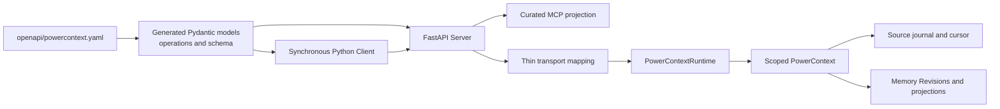
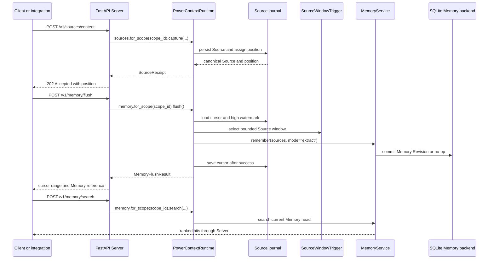

- Proposal Name: `runtime_backed_memory_remote_access`
- Start Date: 2026-07-24
- RFC PR: [oceanbase/powercontext#20](https://github.com/oceanbase/powercontext/pull/20)
- Related RFCs: [RFC 0011](0011_remote_access_architecture.md), [RFC 0019](0019_local_source_memory_runtime.md)

> **注意：** PowerContext 当前使用随 builtin 依赖捆绑的 sqlite-vec 提供 SQLite 向量检索。本 RFC 中关于 Vec1 的
> 表述已不再适用，仅作为原始设计记录保留。

> **执行更新：** [RFC 1430](1430_distributed_server_workers.md) 取代本 RFC 中的单进程调度、仅同步 flush 和
> 非持久 Operation 假设。本 RFC 继续定义 HTTP 映射和生成契约边界。

# Summary

本 RFC 定义首个基于 RFC 0011 架构和 RFC 0019 本地 Runtime 的具体远程 API。FastAPI Server 暴露
`PowerContextRuntime` 提供的 Source capture 和 Memory 操作。同步 Python Client 调用 HTTP contract。
FastMCP 将其中选定的 HTTP 操作投影为面向 Agent 的工具。

仓库中签入的 OpenAPI 文档是 HTTP contract 的唯一事实来源。生成流程产出 Pydantic wire model、operation
metadata 和 FastAPI 提供的 schema。Server mapping 保持轻量，并调用 RFC 0019 定义的 scoped application
service。Client 和 MCP 投影不实现 Memory behavior。

首个部署版本只有一个 trust domain。`scope_id` 是不透明的 application partition，不是 tenant identity 或
authorization boundary。Authentication、multi-tenant policy、durable Operation 和 Codex plugin packaging
不在本 RFC 范围内。

# Motivation

RFC 0011 定义了远程 contract 的职责归属，但没有确定 domain operation。RFC 0019 定义了可工作的本地
Source-to-Memory Runtime，但没有远程边界。只实现其中任一 RFC，都会留下以下问题：

- 哪些 Runtime operation 足够稳定，可以通过 HTTP 暴露？
- 哪些 Core value 可以跨越 wire，而不需要平行的 transport type？
- Server 如何负责 Runtime startup、readiness、capability reporting 和 shutdown？
- 在 scheduling 可选时，Source 的 `202 Accepted` 响应保证什么？
- 哪些 HTTP operation 应该进入 MCP？
- 哪些列表形态的结果是 snapshot、delta 或 ranked top-k result，而不是 page？

本 RFC 针对 Memory family 回答这些问题。它不会增加另一套 Source journal、Memory service、Trigger 或
scheduler。

# Guide-level explanation

## Architecture

Server 是本地 Runtime 外部的一层 adapter。`PowerContext` 仍是该 Runtime 内的 scoped composition root。



OpenAPI 负责公开 JSON shape。Generated code 不负责 application behavior。Server 将 transport request 转换为
已有 Runtime command，并将 Runtime result 映射回 wire response。

## Runtime assembly

基于 Runtime 的进程在 FastAPI lifespan 中打开 `PowerContextRuntime`。如果在 Server event loop 之前打开
Runtime，APScheduler 可能会绑定到错误的 lifecycle。所需顺序如下：

1. 构建 Server settings 和 candidate pipeline configuration。
2. 进入 FastAPI lifespan。
3. 在该 event loop 中打开 `PowerContextRuntime`。
4. 绑定 Runtime application service。
5. 报告由 Runtime 派生的 readiness 和 capability。
6. 接受 HTTP 和 MCP traffic。
7. 在 shutdown 期间将 Runtime 标记为不可用。
8. 在 lifespan 退出前关闭 Runtime。

Assembly 负责持有 candidate pipeline。Application 可以注入符合其产品语义的 pipeline。标准 Server profile
也可以根据配置的 Pydantic AI model 构造 `LLMMemoryCandidatePipeline`，并继续使用 Memory 持有的 extraction
instructions。

`create_app()` 仍可构建未绑定的 contract application，用于 schema inspection 和 adapter test。这类
application 尚未准备好处理 Source 或 Memory traffic。它必须报告 `not_ready`，基于 Runtime 的 endpoint
必须返回 `runtime_not_ready`。

Server CLI 和默认 MCP application factory 始终组装配置指定的本地 Runtime。Runtime 初始化失败时，进程应
直接启动失败，而不是暴露一个无法处理 Source 或 Memory operation 的 listener。只有底层 `create_app()`
支持有意构建未绑定 application。

## Process configuration

Server 和 Client process configuration 使用 `pydantic-settings`。`ServerSettings` 持有 bind address、SQLite
path、Source window limit、可选 schedule interval、generation model、embedding model 与 profile、inference
limit、Vec1 extension path 和 MCP mount。`ClientSettings` 持有 Server URL 和 HTTP timeout。

Vector search configuration 是部署期固定的 tuple：embedding model、profile ID、dimension、normalization 和
Vec1 extension path。Model、profile ID、dimension 与 extension path 必须同时配置。Server 构造 Pydantic AI
embedding adapter 和匹配的 `EmbeddingProfile`，再将两者交给 Runtime。Runtime startup 会在 readiness 变为
`ready` 前探测配置的 extension 与 profile。

环境变量分别使用 `POWERCONTEXT_SERVER_` 与 `POWERCONTEXT_CLIENT_` prefix。Provider credential 仍由
provider SDK 配置。Protocol constant、OpenAPI limit、scheduler job identity 和 persistence table name
不属于 deployment setting。

## Source capture 和显式 flush

按照 RFC 0019 的规定，Source capture 和 Memory extraction 仍然彼此分离。



`202 Accepted` 表示 Source 已持久存在于 Source journal 中，并拥有稳定 position。它不表示 scheduler 已启用、
extraction 已开始或 Memory Revision 已存在。

返回的 Source position 是 synchronization token。需要 read-your-write processing 的调用方可以持续调用
`flush_memory`，直到 `current_cursor` 到达该 position。每次调用处理一个有界 window。Cursor 到达捕获的
position 后，该位置之前的所有 Source 都已经成功处理。随后，search 可以观察到这些 Source 产生的任何
Memory change。

处理 Source 可以产生有效的 no-op。到达 Source position 并不承诺 candidate pipeline 创建了 entry。

## 显式 Memory 写入

`POST /v1/memory/remember` 以 append mode 写入由调用方整理的 Memory content。它不会创建 Source，也不会调用
extraction pipeline。

`expected_revision` 可以缺省，也可以是正数 Memory Revision。缺省时，写入以当前 head 为目标，或创建首个
Revision。提供该值时，被引用的 Revision 必须是当前 head。Memory 不存在时产生 `memory_not_found`，Revision
过期时产生 `revision_conflict`。Revision zero 不表示 "expect absent"，wire contract 会拒绝该值。

Revise 和 retire operation 使用精确的 `MemoryCitation`。被引用的 Memory Revision 作为 optimistic
concurrency base。过期 citation 会产生 `revision_conflict`，Server 不会静默地将它应用到较新的 Revision。

## Query shape

首版 API 有三种列表形态的 query，但都不是通用 page：

| Query | Semantics |
| --- | --- |
| Memory search | 由 `limit` 选取的 ranked top-k result |
| Entry list | 当前 Memory head 的完整 snapshot |
| Revision changes | 从 `since_revision` 之后到当前 head 的 delta |

Search `limit` 不是 pagination size。Response 没有 continuation token，并且 Memory 发生变化后，重复 search
可能产生不同的 ranking。

Entry list 没有 page cursor。其 response 包含该 Memory snapshot 的精确 `ArtifactRef`，调用方可以据此引用
返回的 value。

Changes query 没有 page cursor。`since_revision` 是 exclusive delta boundary。持久化 Memory Revision 从 `1`
开始，因此 wire 使用 Revision `0` 作为读取完整历史的显式哨兵；正数必须标识所选 Memory 中已存在的 Revision。
如果 change volume 以后需要 pagination，必须由单独的 contract 定义稳定的 upper Revision、result limit 和
continuation semantics。
Revision zero 表示首个持久化 Revision 之前的 baseline，因此 `since_revision: 0` 返回到当前 head 为止的完整
Revision delta。

## Python Client

`PowerContextClient` 是生成的 operation metadata 和 Pydantic model 之上的同步 facade。它：

- 使用声明的 request type 序列化 request；
- 要求 operation 声明的 success status；
- 校验成功响应的 body；
- 保留稳定的 Server error 和 `X-PowerContext-Request-ID`；
- 只关闭由它自己创建的 HTTP client。

Client 不会重试 mutation、推断 scheduler state 或隐藏显式 flush behavior。Retry 需要针对 operation 制定规则，
因为 Source capture、Memory mutation 和 search 具有不同的 safety property。

以后可以在不改变 Server semantics 的情况下增加异步 Client 和非 Python SDK。

## MCP projection

MCP 从组装后的 FastAPI application 生成，随后由 allow-list 限制。首批面向 Agent 的工具包括：

- `search_memory`
- `list_memory_entries`
- `get_memory_entry`
- `remember_memory`
- `revise_memory_entry`
- `retire_memory_entry`

Source capture、显式 flush 和 revision changes 不包含在内。Capture 和 flush 是 ingestion 或 operational
control。Revision changes 是 audit query。它们仍可通过 HTTP 和 Python Client 使用。

Health、readiness 和 capability discovery 同样不包含在 MCP tool list 中。增加 HTTP operation 不会自动增加
MCP primitive。

# Reference-level explanation

## HTTP route

当前 HTTP 功能面如下：

| Method | Path | Operation | Success |
| --- | --- | --- | --- |
| `GET` | `/health/live` | `get_liveness` | `200` |
| `GET` | `/health/ready` | `get_readiness` | `200` or `503` |
| `GET` | `/v1/capabilities` | `get_capabilities` | `200` |
| `POST` | `/v1/sources/content` | `capture_content_source` | `202` |
| `POST` | `/v1/memory/flush` | `flush_memory` | `200` |
| `POST` | `/v1/memory/remember` | `remember_memory` | `200` |
| `POST` | `/v1/memory/search` | `search_memory` | `200` |
| `POST` | `/v1/memory/entries/list` | `list_memory_entries` | `200` |
| `POST` | `/v1/memory/entries/get` | `get_memory_entry` | `200` |
| `POST` | `/v1/memory/entries/revise` | `revise_memory_entry` | `200` |
| `POST` | `/v1/memory/entries/retire` | `retire_memory_entry` | `200` |
| `POST` | `/v1/memory/changes` | `list_memory_changes` | `200` |

Memory family operation 保持在 `/v1/memory/` 下。Source capture 保持在 `/v1/sources/` 下。Process probe
不是带版本的 domain operation。MCP Streamable HTTP endpoint 单独挂载在 `/mcp/`。

对于包含 `scope_id`、citation、filter 或 mutation content 的结构化 command 和 query，API 使用 POST。本 RFC
不将这些 request 视为 CRUD resource。

## OpenAPI 和 generation

`openapi/powercontext.yaml` 负责定义：

- path、method、operation identifier 和 success status；
- request 和 response schema；
- error response 和 request ID header；
- HTTP documentation 和 MCP projection 使用的 description。

`make api-generate` 生成：

- frozen Pydantic wire model；
- typed operation metadata；
- FastAPI 提供的 canonical OpenAPI schema。

Generated file 会签入仓库，不得通过直接编辑生成文件来代替修改 OpenAPI。`make api-generate-check` 在内存中
重新生成 source，并在存在 drift 时失败。Lock file 提供仓库使用的 generator、formatter、FastAPI、Pydantic
和 YAML version。

Core dataclass 不能直接作为 transport model。其 constructor 不执行 `minimum`、required nullable field 或
strict primitive type 等 OpenAPI constraint。因此，object schema 生成 Pydantic model，并显式映射到 Core
value。Wire enum 同样在 API layer 生成，因此导入 Client SDK 不会加载 Memory、Runtime 或 BuiltIn module。
精确 Memory 与 entry identifier 会在 transport boundary 校验为非空、有长度上限的 printable ASCII value，
之后才进入 Core 或 persistence code。

## Core 与 transport type boundary

Transport 自己持有 search、state、match 和 change enum。Generated wire value 在 Server boundary 映射到
`ArtifactRef`、`MemoryCitation`、`MemoryChange`、`MemoryRevisionChanges` 和 `MemoryHit`。

精确 Artifact reference 只有一种 JSON shape：

```json
{
  "artifact_id": "memory-123",
  "revision": 4
}
```

API 不得为同一概念引入使用 `memory_id` 的第二种 `MemoryReference`。

精确 entry citation 也只有一种 shape：

```json
{
  "memory_ref": {
    "artifact_id": "memory-123",
    "revision": 4
  },
  "entry_id": "entry-7",
  "entry_version_id": "entry-version-9"
}
```

Get、revise 和 retire request 使用 `scope_id` 和 command 特有字段封装该 `MemoryCitation`。Citation 已经包含
预期的 Memory Revision。

当 wire 增加 Core 不负责的信息时，使用 transport-only model 仍然合理：

| Transport model | Reason |
| --- | --- |
| Scope-bearing request | `scope_id` 是 application routing value |
| `MemoryEntry` response | 组合 entry version、manifest state、精确 Memory reference 和 lineage |
| Capture and flush response | 报告 journal position 或 cursor progress |
| Capabilities | 描述组装后的 Server behavior |
| Error envelope | 定义稳定的 HTTP failure data |

`SourceReference.name` 是稳定的 Source type，例如 `content`。`source_id` 是 Source identity。Adapter name
不属于 wire contract。首个 Runtime profile 支持 `ContentSource`，未来的 Source implementation 需要提供从
canonical Source type 和 identity 到 wire 的显式 mapping。

## Thin Server mapping

Server mapping 可以：

- 根据 wire request 构造 `ContentCapture`；
- 根据 generated request 构造 Runtime command value；
- 将 Runtime entry state 和 entry version 组合成 response；
- 在不改变字段名称的前提下转换 Core reference。

它不得实现 extraction、deduplication、revision selection、cursor movement、search ranking 或 Source
identity rule。这些职责属于 RFC 0019 和 Memory service。

Mapping boundary 应使用具体的 application protocol type。如果 optional package dependency 使这些 import
难以处理，应将 dependency-free application contract 移到小型 module 中。在整个边界使用 `Any` 会移除有用的
static check，不是目标设计。

## Scope 和 trust

每项 Source 和 Memory operation 都要求显式 `scope_id`。Server 只校验其基本 shape，并将它原样传给 Runtime。

首个部署版本假设所有调用方都属于一个 trust domain。知道其他 `scope_id` 的调用方可以访问它。因此，
`scope_id` 不是 access token、tenant identifier 或 security boundary。

接受不受信任 network client 的部署，在依赖这些 route 之前需要先制定 authentication 和 authorization RFC。

## Error contract

每个 response 都包含 `X-PowerContext-Request-ID`。Server 接受安全的调用方提供值，或自行生成该值。Client 将它保存在
structured failure 中。

首批稳定 error code 如下：

| HTTP status | Code | Meaning |
| --- | --- | --- |
| `404` | `memory_not_found` | 请求的 Memory Revision 或 entry 不存在 |
| `409` | `source_conflict` | 同一 Source identity 已有不同 content |
| `409` | `revision_conflict` | Mutation 基于过期的 Memory Revision |
| `409` | `memory_entry_inactive` | Mutation 指向 inactive Memory entry |
| `422` | `invalid_request` | Request 违反 wire 或 application contract |
| `422` | `capability_not_supported` | 组装后的 Runtime 无法执行请求的 mode |
| `503` | `runtime_not_ready` | 没有可用的 Runtime binding |
| `503` | `inference_timeout` | 配置的 Memory inference 超过 time limit |
| `503` | `inference_unavailable` | 配置的 Memory inference 不可用 |
| `500` | `internal_error` | Server 失败，且不暴露内部细节 |

Error code 是公开 wire value。Message 用于解释，可以在不改变 code 的情况下改进。

Server 只将已知 validation 和 domain exception 映射为 `4xx`。Mapping 或 Runtime code 中一般性的
`TypeError` 或 `ValueError` 不会被自动视为 client error。未知 exception 产生 `internal_error`，并在 Server
log 中保留 traceback。

## Readiness 和 capabilities

Liveness 报告 HTTP process 是否可以响应。

Readiness 报告已配置的 Runtime binding 是否可以提供其声明的 operation。基于 Runtime 的 readiness check
至少覆盖：

- application binding 是否存在；
- Runtime initialization 是否完成；
- Source 和 Memory backend 是否可用；
- shutdown state。

Capabilities 来自同一 assembly。它们报告实际可用的 Source type、Artifact family、search mode 和 public
limit。Server 不得将未绑定的 application 与 ready probe 组合，也不得声明由其他 Runtime instance 提供的
capability。

默认 SQLite profile 声明 `auto` 与 `fts`。Vector configuration 成功初始化后，额外声明 `vector` 与 `hybrid`。
`auto` 是 request policy，而不是物理 index；Memory service 按稳定 search contract 选择最强可用 mode，并可以
回退到 FTS。Server 不会仅根据 settings 声明 vector mode；Runtime initialization 必须先接受相互匹配的
embedding model、profile 与 Vec1 extension。

Scheduler enablement 不改变 capture contract。如果调用方需要区分 scheduled processing 和 manual flush，
可以将它作为 capability 报告。

## Lifecycle ownership

基于 Runtime 的 Server 按以下顺序持有 resource：

```text
Server lifespan
  -> PowerContextRuntime.open()
      -> Source backend
      -> scoped Memory backends on demand
      -> optional persisted scheduler
  -> accept requests
  -> stop accepting Runtime work
  -> PowerContextRuntime.close()
  -> lifespan exit
```

HTTP Server 不持久化 APScheduler job 或 Source cursor。它调用已经按照 RFC 0019 持有这些细节的 Runtime。

# Drawbacks

API 暴露显式 flush 和精确 citation 等 Runtime concept。这比单一的 "remember this" endpoint 更冗长，但能将
durable Source acceptance 与 model-driven extraction 分开。

OpenAPI-first development 要求每次 contract 更新时同步生成变更。复用 Core type 也需要显式 compatibility
test，因为仅有 Python import identity 不能证明 wire compatibility。

Snapshot 和 delta query 很简单，但其 response size 可能增长。以后增加 pagination 时，需要作出新的
compatibility 决策，不能重新解释现有 `limit` 或 `since_revision` 字段。

首个 trust-domain model 不适用于公开共享服务。它仅限本地或其他受信任部署。

# Rationale and alternatives

## 直接暴露 Runtime class

直接序列化 Runtime dataclass 可以减少 mapping code，但会将 wire compatibility 与 Python application API
绑定。Transport-only scope 和 error data 也会泄漏到 Runtime model 中。

本 RFC 在 Core type 的完整语义匹配时复用它们，并在 OpenAPI 中保留 transport aggregate。

## 生成 Server behavior

Generated handler 可以调用 Runtime method，但 generation 需要理解 scope selection、lifecycle、domain
error 和 entry projection。这些规则规模较小，作为手写 mapping 更容易审查。

本 RFC 生成 wire model 和 operation metadata，并将 behavior 保留在轻量 Server code 中。

## 通过 MCP 暴露每条 HTTP route

镜像每个 endpoint 会在没有 use case 的情况下向 Agent 暴露 ingestion 和 operational control。它还会让未来的
HTTP 增量意外改变 Agent tool surface。

本 RFC 使用显式 MCP allow-list。

## 通过 capture 承诺 scheduler completion

`202` response 可以隐含 queued execution，但 RFC 0019 允许 Runtime 不启用 scheduling。凭空增加 durable
Operation 还需要 status、cancellation、retention 和 idempotency semantics。

本 RFC 承诺 durable Source capture，并返回 journal position。显式 flush 提供 synchronization path。

## 立即增加 pagination

Entry 和 change volume 以后可能需要 pagination。正确的 cursor 必须绑定到稳定 Memory Revision 和 ordering
rule。当前 Runtime API 返回 head snapshot 和 Revision delta，因此只在 wire layer 增加 page 字段会给出虚假的
stability。

本 RFC 准确命名当前 semantics，并推迟 pagination。

# Prior art

本地 Mem0 checkout 在不同 HTTP operation 中分开 memory creation、search、listing、exact read、update 和
history。其 OpenMemory package 也暴露更小的 MCP tool surface。这支持分别审查 HTTP 和 Agent 功能面，但
Mem0 的 identity 和 processing model 不是 PowerContext contract。

本地 EverOS checkout 将 add、flush、search 和 get operation 归入带版本的 Memory prefix。其 search 和 get
endpoint 使用显式 request 和 response DTO。这为按 family prefix 组织 command/query route 提供了有用证据，
但不是复制其 owner 或 pagination model 的理由。

本地 Acontext checkout 使用 project 和 session path、显式 session flush、生成的 OpenAPI artifact 和
integration-specific Agent tool。它说明 process control 与 Agent tool 可以有不同边界。其 skill-memory model
不决定 PowerContext Source 或 Artifact semantics。

这些项目为 interface review 提供了参考。RFC 0011 和 RFC 0019 仍是本提案的规范基础。

# Compatibility

本 RFC 在已有 Runtime behavior 外增加远程 contract。它不改变 Core Source、Artifact、Trigger、Memory 或
`PowerContext` semantics。

OpenAPI request 和 response shape 会成为公开 compatibility surface。重命名字段、改变 success status、移除
error code，或改变 `scope_id`、Source position、Memory Revision 或 citation 的含义，都需要正常的 API
compatibility review。

Generated Python model layout 不是公开 compatibility surface。Public import 和 Client facade behavior 才是。

Source journal、cursor、scheduler recovery、Memory persistence 和 replay behavior 仍由 RFC 0019 管理。Server
不得削弱这些保证。

# Acceptance criteria

实现满足以下条件时即告完成：

- 执行 `make api-generate` 后，repository diff check 不产生任何 generated change。
- `make api-generate-check` 和 contract test 在 locked environment 中通过。
- Client import-isolation test 验证 API loading 不会导入 Memory、Runtime 或 BuiltIn module。
- Server 通过 lifespan 打开和关闭 `PowerContextRuntime`。
- 有意保持未绑定的底层 Server 报告 `not_ready`；production Server 和 MCP factory 要么组装 Runtime，要么
  在启动阶段失败。
- Readiness 和 capability 从绑定的 Runtime assembly 派生。
- 同步 SDK 通过 HTTP 捕获真实 Source，并收到其 durable position。
- SDK 持续 flush，直到返回 cursor 到达该 position。
- SDK search 和 entry listing 读取真实 Runtime 产生的 Memory。
- 返回的 Memory entry 包含与捕获的 Source type 和 identity 匹配的 Source lineage。
- Explicit remember、revise、retire、exact get 和 changes 通过 HTTP 对真实 Runtime 工作。
- 真实 MCP client 至少针对同一 Runtime 执行 remember、search、list 和 exact get。
- MCP 不暴露 capture、flush、changes、health、readiness 或 capability。
- Source conflict 返回 `409 source_conflict`。
- 过期 citation 返回 `409 revision_conflict`。
- 缺失 citation 返回 `404 memory_not_found`。
- 错误 Memory identity 返回 `404 memory_not_found`；正确 identity 的过期 Revision 返回
  `409 revision_conflict`。
- 无效 request 返回 `422 invalid_request`。
- `since_revision: 0` 返回完整且有序的 Revision delta。
- 不可用的 Runtime binding 返回 `503 runtime_not_ready`。
- 成功和失败 response 都携带 `X-PowerContext-Request-ID`，且 Client 会保留它。
- Search result 被描述为 top-k result，entry list 被描述为 snapshot，changes 被描述为 delta。
- 所有 Memory reference wire model 都精确映射到 Core `ArtifactRef`，精确 entry operation 通过
  `MemoryCitation` 映射。
- Explicit remember 拒绝 revision zero，并保留 Memory 不存在与 Revision 过期这两种不同 error。
- Source capture 承诺 durable journal acceptance，但不承诺 scheduler execution。
- RFC 0019 restart test 仍能恢复 Memory head、Source lineage、cursor 和持久化 scheduler job。
- RFC 0019 replay test 仍能处理 Memory commit 成功后 cursor commit 失败的情况。

# Out of scope

本 RFC 不定义：

- authentication 或 authorization；
- multi-tenant isolation；
- durable Operation resource 或 job status API；
- distributed worker、claim、lease 或 exactly-once processing；
- 本地 Runtime profile 以外的其他 Source type；
- model provider selection 或 extraction prompt；
- 异步 Python Client 或非 Python SDK；
- Codex plugin manifest、installation 或 packaging。

# Unresolved questions

- Scheduler enablement 是否应出现在 `Capabilities` 中，还是 readiness 加显式 flush 已经足够？
- Entry snapshot 变大后，pagination 应使用 entry identity 还是 manifest position？
- Client 是否应提供一个 helper，重复执行 flush 直到处理完捕获的 Source position？

# Future possibilities

后续 RFC 可以增加 authentication 和 tenant-aware scope authorization，而无需改变 Memory 和 Source
semantics。另一项提案可以在 capture 需要跨 worker 的可观察后台完成状态时增加 durable Operation。

一旦 cursor 绑定到精确 Memory Revision 和 ordering rule，即可增加 pagination。在 HTTP 功能面具备
conformance coverage 后，可以根据同一 OpenAPI contract 生成其他 SDK。

当 MCP tool、Server lifecycle 和 trust model 足够稳定，可以在 developer checkout 之外安装时，再开展
Codex plugin packaging。
