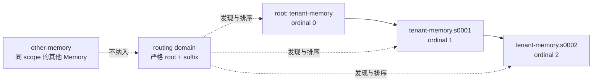

- 提案名称：`memory_capacity_and_sharding`
- 开始日期：2026-08-28
- RFC PR：[oceanbase/powercontext#1387](https://github.com/oceanbase/powercontext/pull/1387)

# Summary

本 RFC 为 flat-v1 Memory 引入以条目数为边界的 shard、围绕配置根 ID 的 routing domain，以及。一个逻辑 Memory 可以由多个不可迁移的 Memory Artifact shard 组成；每个 shard 继续使用现有的 Artifact Revision、manifest、不可变 entry version、active-head projection 和 head CAS。

写入时新增可以在容量达到上限后自动进入下一个 shard。带 `expected_revision` 的写入、基于 citation 的 revise/retire/reactivate，以及 citation 驱动的 organize 都保留原 shard 身份，容量不足时返回稳定的容量错误。Source flush 则在一次规划中观察 routing domain 的全部 current heads，使用完整 active-entry 并集进行候选生成和精确去重；候选中的 revise 在所属 shard 原地提交，新增候选进入写目标 shard，受影响的多个 shard 与 Source cursor 在同一外层事务中提交。

本 RFC 不改变 flat-v1 的持久化形状，不迁移历史条目，不物理删除旧 Revision，也不把 scope 或 routing domain 变成新的 Core identity。它解决的是当前单 Artifact manifest 随条目增长而放大的容量和读取问题。

# Motivation

RFC 0014 将 Memory 定义为不可变 Artifact Revision 的生命周期，并让 manifest 作为当前 entry 状态的权威目录。当前实现的每次 append 都把完整目录写入新的 Revision；因此连续新增会产生 1、2、…、N 项目录，存储和写放大呈现明显的二次增长。`entries()` 和 `changes()` 也以完整 manifest 或完整历史为读取单位，随着数据增长会变成不可控的单次操作。本rfc在保持rfc0014的manifest保存全量快照的语义下为持续增长导致的极限情况封顶，防止无限的存储和写放大

本 RFC 的目标是：

- 保留Memory flat-v1 设计，让存储和写放大在合适的位置封顶
- 将新增压力限制在单个 shard，并在必要时提供确定性的下一 shard；
- 保留 entry identity、entry version 和 citation 的不可变语义；
- 让 flush 的候选上下文和精确去重覆盖 routing domain，而不是只覆盖一个 shard；
- 让跨 shard revise 仍在原 owner shard 上发生，并让多 shard flush 具备全有或全无的提交语义；
- 让 list 和 changes 以不可变 Revision 为快照边界；

# Guide-level explanation

## Shard 与 routing domain

一个 scope 的配置会给 Memory 指定一个 `root_artifact_id`。root 本身是 ordinal 0；自动创建的后续 shard 使用 `root.s0001`、`root.s0002` 等 ID。只有 root 和严格匹配该 root 的 suffix 属于同一个 routing domain；同一个 scope 下其他 Memory Artifact 不会因为 family 都是 `memory` 而被纳入。



shard 是存储和并发边界，不是新的逻辑 entry identity。条目一旦落入某个 shard，其 `memory_artifact_id` 就固定；后续 revise、retire、reactivate 和 citation 都使用该 shard 的精确 ArtifactRef。split 只决定新 entry 的写入位置，不搬运旧条目。

## 写入行为

当调用方执行无条件的纯 append 时，Runtime 选择最高 ordinal 的 shard。若计划后的 manifest 超出 `memory_manifest_max_entries`，Runtime 在下一个 ordinal 的空 shard 上重新规划整批新增。整批重规划而不是把部分条目塞入旧 shard，可以保证同一次请求内的精确内容去重不会因分区而失效。

下面这些操作不会静默换 shard：

- 带 `expected_revision` 的 explicit remember；
- 以精确 citation 为目标的 revise、retire、reactivate；
- 针对一个指定 Memory 的 organize。

这些操作的容量或身份不满足要求时返回稳定的 `memory_capacity_exceeded`，调用方可以看到失败原因，而不会把针对旧 Revision 的条件悄悄套到另一个 Artifact 上。

## flush 的单片语义扩展

Source flush 先读取 routing domain 的所有 current heads。candidate pipeline 一次收到所有 shard 的 active entries；pipeline 的输入不按本 RFC 截断，也不因 shard 数增加而改变候选规则。模型提出 revise 时必须同时指明 `memory_artifact_id` 和 `entry_id`；add 不携带目标身份。

候选处理遵循以下语义：

1. revise 目标必须是本次快照中的 exact current entry，并回到它所属的 shard；
2. add 使用最高 ordinal shard作为写目标；
3. 所有 shard 的 active canonical `content_bytes` 组成全局去重集合；hash 只用于加速，命中后仍比较 canonical bytes；
4. 同一批候选共享并更新这个全局集合；
5. 每个受影响 shard 生成一个普通 Memory commit；所有 commit 和 source cursor 一起提交或回滚。

例如，`tenant-memory` 中已有旧事实，`tenant-memory.s0001` 是当前写目标：模型可以在 root revise 一条旧事实，同时在 s0001 add 一条新事实。两项变更分别落在 owner shard 和写目标 shard，entry 的 citation 身份不改变。

## 有界读取

list 和 changes 不追踪会变化的 head，而是绑定一个 exact immutable Revision：

- list 在固定 Revision 中按 state 过滤并按 `entry_id` 分页；
- changes 在固定 shard 的固定 target Revision 中按 revision 分页；
- cursor 绑定 scope/root、family、exact target ref、过滤条件和固定 page size，不能跨 routing domain 重放；
- 要读取一个 scope 的完整内容或历史，调用方先枚举 routing domain，再对每个 shard 独立分页。

这意味着分页期间创建的新 shard、新 Revision、新 entry 或 reactivation 不会混入已有 cursor 链。调用方重新枚举 routing 才能看到新的快照。

## inactive tombstone compaction

inactive 条目仍保留在当前 manifest，直到普通写入触发压缩。压缩只从新 Revision 中移除不属于本批业务变更的 inactive 项，并以 `drop` change 审计该动作；旧 Revision、旧 entry version 和旧 citation 仍可解析。正在本批 retire 的条目至少保留一个 Revision，避免 mutation response 在提交后立即失去目标。

`drop` 是 manifest 压缩的审计操作，不是物理删除，也不允许被当作用户业务 change 的返回目标。

# Reference-level explanation

## 不变量

### Identity

- `Memory` 的持久化 identity 仍是 `(family, artifact_id)`；routing domain 只是由配置 root 派生的发现集合。
- shard ID 解析先匹配 exact root，再使用严格的 `root.s([1-9][0-9]*)` full match；排序使用解析后的整数，禁止前缀误匹配。
- root 和 suffix 以及 entry/version ID 继续遵守既有 identifier 长度和 ASCII 约束。生成 suffix 超出限制时返回 `split_id_exhausted`。
- `MemoryEntryVersion.memory_artifact_id`、manifest 中的 entry pointer 和 citation 的 `memory_ref` 必须指向同一 shard。

### Manifest 与版本

每个 shard 继续使用 flat-v1：manifest 只保存 `entry_id`、`entry_version_id`、`entry_content_hash` 和 `state`，正文在不可变 `MemoryEntryVersion` 中。最终 manifest 的 entry 数不得超过 `memory_manifest_max_entries`（默认 200，`ge=1`）；条目数是容量判断维度。

### Candidate identity

当前 baseline extraction 只用裸 `entry_id` 构造 `current_entries` 映射和 `revised_entries` 集合。在多 shard 场景下这会把两个 shard 中同名的 entry 错认为同一个目标。拟议模型语义如下：

```text
MemoryExtractionCurrentEntry:
    memory_artifact_id
    entry_id
    kind
    text

MemoryExtractionCandidate:
    intent: add | revise
    kind
    text
    evidence_ids
    memory_artifact_id: string | null
    entry_id: string | null
    reason
```

add 必须同时省略两个目标字段；revise 必须同时提供两个字段。pipeline 映射时使用：

```text
entry key          = (memory_artifact_id, entry_id)
version membership = (memory_artifact_id, entry_version_id)
```

目标必须属于本次 exact heads 的 validated current entries；未知 owner、裸目标、旧 Revision 目标或跨 shard version 都按不可信候选拒绝。映射完成后才生成普通 `MemoryEntryInput`，不能让模型输出的裸 ID直接进入 commit。

## 容量与压缩

所有会构造新 Memory Revision 的写路径都对最终 manifest 执行同一个收尾规则：先按阈值和容量条件压缩可删除的 inactive tombstone，再检查 `len(final_manifest) <= memory_manifest_max_entries`。容量检查发生在 embedding/projection 准备之前；失败不会写入 Artifact、entry、projection 或索引。

`memory_tombstone_compaction_threshold` 控制是否因 tombstone 数量触发压缩，`memory_compaction_max_drops` 只限制一次 Revision 的内部 drop 批次，不限制 remember 或 candidate 的输入条数。合法的大批量输入不被隐式截断；只有最终 manifest 超预算时整批失败。

稳定错误使用：

```text
HTTP: 413 Payload Too Large
code: memory_capacity_exceeded
reason: manifest_entries | split_id_exhausted
```

## flush 事务与并发

只比较规划前后的 head 集合不足以保护仅作为 candidate/dedupe 上下文的 shard。flush 必须锁住整个 routing domain：

- 已存在 root 时，在外层事务开始后先锁 root head 行，再按 ordinal 读取所有合法 shard heads；
- root 不存在时，使用数据库支持的 `SERIALIZABLE` 或等价 predicate-conflict 保护 bootstrap；不能把不存在的行当作可锁定对象；
- 所有会改变该 routing domain 的 writer，包括显式 shard 写、split、flush、organize 和新 shard 创建，都先取得同一 barrier；
- heads 读取、候选生成、全局去重播种、per-shard plan、按 ordinal apply 和 cursor save 使用同一 bound connection；
- backend 不支持行锁和可靠 bootstrap 隔离时，不启用多 shard flush，而不是降级为无保护的 head 复核。

成功顺序为：

```text
routing barrier
  -> exact heads and active union
  -> one candidate extraction
  -> qualified per-shard plans
  -> ordinal-ordered commits
  -> source cursor save
  -> outer commit
```

任一 CAS、锁、serialization、候选校验或容量错误都会回滚所有 shard 变更且不推进 cursor。per-shard CAS 仍然保留；barrier 是稳定读保护，不替代持久化层的条件写校验。

## API 语义

本 RFC 需要对 Runtime/HTTP 公开以下概念，但不规定具体 transport 命名必须与实现文件一致：

- routing enumeration：返回 root、合法 shard 的 exact head、ordinal、entry/active 计数和可写提示；
- list entries：可选 exact `memory`、`limit` 和不透明 `next`，返回固定 shard snapshot；
- list changes：可选 exact `memory`、`since_revision`、`limit` 和不透明 `next`，返回固定 shard history page；
- flush result：保留兼容的 `memory_ref`，并增加本次触及 shard 的 `memory_refs`；
- `EntryChangeOperation` 增加 `drop`；
- capacity error 及其稳定 reason/details。

`memory_ref` 仍是精确 citation 的权威身份；响应中的页级 memory 只是该页 snapshot 的提示。scope 级完整读取不是一个把多个 shard 拼成单一 Revision 的伪快照。

## 与 baseline 的边界

现有 `MemoryService._candidates()`、`_prepare_commit()`、`LLMMemoryCandidatePipeline.extract()` 和 `MemoryBackend` 都以单个 `Memory`/单个 commit 为中心。实现需要在这些边界之上增加 routing-aware orchestration 和 multi-commit plan，但不应通过让 `MemoryEntryInput` 携带未经验证的 shard 字符串来绕过现有 `_claim_revision_target()`、canonical bytes、manifest hash 或 backend CAS。

## 兼容性与迁移

- 不需要数据库 schema migration；既有 root 自动成为 ordinal 0。
- 非法 suffix 或同 scope 的其他 Memory Artifact 不会自动纳入 routing domain，避免改变既有 identity 集合。
- 单 shard 调用的 MemoryService lifecycle 保持原语义；新增的 routing、分页和跨 shard flush 是扩展或收紧的 Runtime/API 契约。
- list/changes 从一次返回完整结果改为有界 page 是有意的行为变化；旧客户端应通过 routing 和 cursor 适配。
- `since_revision` 不再代表多个 shard 的统一进度。未指定 memory 时仍只作用于配置 root，以免把旧调用悄悄解释成跨 shard 查询。
- 历史 citation 即使条目被 compaction drop，也仍能按照旧 exact Revision 读取；当前 head 不再允许通过已 drop 的条目执行 reactivate/revise。

# Drawbacks

- shard 数和 routing、barrier、multi-commit 事务提高了 Runtime、backend 和 API 的复杂度。
- flush 的完整 active-entry 并集随 shard 数增长，candidate pipeline 的 token、延迟和模型上下文压力也增长；但并非本设计引入
- 单个 shard 仍以完整 flat-v1 manifest 写入；revision-heavy 工作负载的历史累计字节没有硬上界。
- list/changes 的客户端需要理解 routing 和每 shard checkpoint，而不再是一个简单的全局列表或整数进度。
- tombstone drop 改变当前 manifest 的可操作性，虽然不会破坏旧 exact citation。

# Rationale and alternatives

## 只拒绝超容量写入

拒绝所有超容量 append 最简单，但 Memory 会在达到上限后永久不可新增，调用方必须人工创建并绑定新的 Artifact，且不同客户端会形成不一致的路由规则。本 RFC 只对无条件纯新增提供自动 split，并保留条件写的明确失败语义。

## 不选择flat-v2 manifest

flat-v2 delta manifest 能同时压低两个轴，但要动 canonical-hash、把 manifest 变成 checkpoint 链，并使 citation 钉住的 exact Revision 失去“已在rfc-0014决定的完整自包含 manifest”的性质。shard 方案完全不动 flat-v1 的持久化形状和 citation 语义。因此先 shard、后（如有必要）flat-v2。

## 搬迁旧条目到新 shard

搬迁会改变 `memory_artifact_id`，使旧 citation、entry version owner、projection 外键和审计历史难以保持原义。原地 revise、只把新 add 放到新 shard 能保留稳定 identity，因此不采用迁移。


## 用 follow-head keyset 做 scope 级分页

head 在分页期间会前插新 entry；以 `(ordinal, entry_id)` 继续读取无法恢复已漏掉的项。固定 exact Revision 需要为每个 shard 建立独立 cursor，代价是调用方多做一次 routing，但语义可证明且可重放。

## 给每个 flush shard 单独调用 candidate pipeline

逐 shard调用会丢失跨片上下文，且精确去重不能防止跨片重复。一次完整输入、按目标分区和多 commit 事务能保持单片 pipeline 的语义；

## 使用简单触顶后墓碑清理

预先有考虑过基于脏比例和墓碑年龄来进行清理，但是墓碑年龄会引入额外复杂性并且存在兼容性问题。压力触发本身在撞墙时就会清掉可清墓碑，已经覆盖了脏比例场景；


# Prior art

- 延续 RFC 0014 的flat-v1、immutable Revision、entry version、active-head projection、candidate pipeline 和精确 citation；
- 延续 RFC 0019 的 Source cursor、scope lock 和 flush retry；
- 延续 RFC 0020 的 exact reference 与 transport mapping 分层。


# Unresolved questions

- `memory_manifest_max_entries`、tombstone threshold 和 drop batch 的默认值需要规模测试校准；默认值不是性能或存储保证。
- routing endpoint 的分页、缓存和权限策略尚未定义；本 RFC 不把 scope 提升为 authorization boundary。
- 未来是否需要 scope-level 原子快照、跨 shard merge 或历史 Revision 归档，应另行提出 RFC。
- 多 shard flush 在模型上下文不足时应由 pipeline 自己报告能力错误，还是由独立的显式窗口/检索方案解决，暂不在本 RFC 中决定。
- 储存放大和写放大的根本原因在于manifest flat-v1 保存全量条目，本rfc并没有解决根本原因

# Future possibilities

后续可以设计增量 manifest（例如 flat-v2）、Revision 历史归档或受控清理，以治理 revision-heavy 工作负载的累计存储；可以设计 shard merge/routing policy，但必须先定义 citation、并发和历史兼容语义。

未来的 scope-level snapshot token 可以让客户端取得跨 shard 的一致读视图，但它会引入新的快照生命周期、存储和并发协议，不属于本 RFC 的 exact per-shard snapshot 方案。

# Acceptance criteria

- 每个新 Revision 的最终 manifest 都执行统一 entry budget 和 tombstone compaction 规则；容量失败不产生持久化副作用。
- 默认 root、自定义 root、root 自带 suffix、非法 suffix、超长 split ID 和非 domain Memory Artifact 都有明确结果。
- 无条件 pure-add 满 shard 后能整批进入下一 shard；CAS 写和 citation 操作不会静默换 shard。
- 多 shard flush 能看到全部 active union；同 ID 跨 shard 时只能 revise 指定 owner；全局 canonical bytes 去重不会产生跨片精确重复。
- revise/add 混合 flush 在所属 shard 分别提交；所有 per-shard commit 与 Source cursor 原子提交，失败全部回滚。
- routing barrier 覆盖从 heads 读取到 cursor 保存的整个 flush；root 缺失并发 bootstrap 不产生两个有效 root。
- list/changes cursor 绑定 exact immutable shard snapshot，分页无重复、无遗漏，且拒绝跨 scope/root/family 重放。
- `drop` 可审计、不会破坏旧 citation，mutation response 不把 drop 当作业务目标。
- search、prepare context、statistics 和 citation lifecycle 对合法 root shards 的 identity 处理一致。
- 合法大批量 remember/candidate 不被人为的 100-item 上限截断；只受最终 manifest budget 影响。
